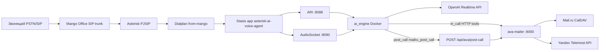

# Quantum Labs AVA — Agent Onboarding (READ FIRST)

**Назначение:** голосовой AI-ассистент для **входящих звонков** в Quantum Labs: приветствие, сбор данных, запись на встречу, проверка календаря, создание события в Mail.ru Calendar, ссылка **Яндекс Телемост**, письмо с презентацией, пост-звонковый разбор и письмо менеджеру.

**Стек на этом сервере:** Asterisk AI Voice Agent (`/root/ava`) + FastAPI mailer (`/opt/ava-mailer`) + Asterisk PJSIP (Mango Office) + OpenAI Realtime API.

> Секреты **не** документируются. Только пути к `.env` и имена переменных.

---

## Архитектура



**Поток звонка (кратко):**

1. Mango → `mango-endpoint` → контекст `[from-mango]` → `Answer()` → `Stasis(asterisk-ai-voice-agent)`.
2. `ai_engine` подключается по **ARI** (управление каналом) и **AudioSocket** (аудио 8 kHz, см. `audio_transport: audiosocket` в конфиге).
3. Провайдер **`openai_realtime`** (модель и голос — в `config/ai-agent.local.yaml`).
4. Во время разговора: `check_calendar` / `create_calendar_event` на **ava-calendar `:8014`** (Telemost через **ava-conference `:8016`**), `create_conference` напрямую на `:8016`, knowledge пока через mailer `:8000`.
5. После звонка: webhook `mailru_post_call` → `/api/ava/post-call` (транскрипт, извлечение лида, email).

---

## Ключевые пути и порты

| Что | Путь / значение |
|-----|-----------------|
| Проект AVA (AI engine) | `/root/ava` |
| Точка входа контейнера | `/root/ava/main.py` → `src.engine.main` |
| Базовый конфиг | `/root/ava/config/ai-agent.yaml` |
| **Операторский override (главный)** | `/root/ava/config/ai-agent.local.yaml` |
| Секреты AVA | `/root/ava/.env` |
| Mailer (календарь, email, Telemost) | `/opt/ava-mailer/` |
| Mailer entrypoint | `/opt/ava-mailer/main.py` (uvicorn) |
| Секреты mailer | `/opt/ava-mailer/.env` |
| Yandex OAuth модуль | `/opt/ava-mailer/yandex_oauth.py` |
| Токены Telemost OAuth | `/opt/ava-mailer/yandex_oauth_tokens.json` (путь переопределяется `YANDEX_OAUTH_TOKEN_FILE`) |
| Dialplan | `/etc/asterisk/extensions.conf` |
| ARI users | `/etc/asterisk/ari.conf` |
| PJSIP (объекты в runtime) | `mango-registration`, `mango-endpoint`, `mango-auth`, `ava-test` |
| Systemd mailer | `/etc/systemd/system/ava-mailer.service` |
| Бэкап | `/root/ava/scripts/backup_quantum_labs.sh` → `/root/backups/quantum-labs-full-*.tar.gz` |
| E2E тесты | `/root/ava/scripts/quantum_e2e_test.py`, `quantum_e2e_test.sh` |
| Локальный SIP-тест | `/root/ava/scripts/quantum_sip_test_call.py` |

| Сервис | Порт | Назначение |
|--------|------|------------|
| SIP UDP | **5060** | Asterisk PJSIP (`transport-udp`) |
| ARI HTTP | **8088** | REST + WebSocket к Asterisk (`ASTERISK_ARI_PORT`) |
| AudioSocket | **8090** | Аудиопоток AI ↔ Asterisk (`audiosocket.port`) |
| ava-mailer | **8000** | Calendar API, post-call, OAuth UI |
| ai_engine health / metrics | **15000** | `GET /health`, Prometheus `/metrics` |
| admin_ui | **3003** | `UVICORN_PORT` в `.env` (опционально) |
| local_ai_server WS | **8765** | Локальные модели (не основной прод-путь Quantum) |

**Docker (host network):**

| Container | Image context |
|-----------|----------------|
| `ai_engine` | `/root/ava` — основной голосовой движок |
| `local_ai_server` | `/root/ava/local_ai_server` |
| `admin_ui` | `/root/ava/admin_ui` |

---

## Конфигурация: `ai-agent.yaml` + `ai-agent.local.yaml`

Загрузка: `src.config.loaders.load_yaml_with_local_override()`:

1. Читается **`config/ai-agent.yaml`** (upstream defaults, большой файл).
2. Если есть **`config/ai-agent.local.yaml`** — **deep-merge поверх base** (словари рекурсивно; скаляры и списки из local **заменяют** base).
3. В YAML поддерживается `${VAR}` и `${VAR:-default}` из окружения процесса / `.env`.

**На этом сервере весь продуктовый сценарий Quantum Labs задаётся в `ai-agent.local.yaml`:** русский промпт, `openai_realtime`, `in_call_tools`, `mailru_post_call`, tuning VAD/barge-in.

Контекст диалплана: `AI_CONTEXT=default`, `AI_PROVIDER=openai_realtime` (см. `extensions.conf`).

---

## Переменные окружения (только расположение)

| Файл | Примеры переменных (без значений) |
|------|-----------------------------------|
| `/root/ava/.env` | `OPENAI_API_KEY`, `ASTERISK_HOST`, `ASTERISK_ARI_PORT`, `ASTERISK_ARI_USERNAME`, `ASTERISK_ARI_PASSWORD`, `HEALTH_BIND_PORT` |
| `/opt/ava-mailer/.env` | `WEBHOOK_TOKEN`, `MAIL_*`, `MAILRU_CALDAV_*`, `OPENAI_API_KEY`, `YANDEX_OAUTH_*`, `TELEMOST_*`, `WELCOME_*` |

Заголовок post-call в YAML: `X-Webhook-Token` — **должен совпадать** с `WEBHOOK_TOKEN` в mailer `.env` (не дублировать значение в git/docs).

---

## Asterisk dialplan (Quantum Labs)

Файл: `/etc/asterisk/extensions.conf`

```ini
[from-mango]
exten => s,1,Answer()
 same => n,Set(AI_CONTEXT=default)
 same => n,Set(AI_PROVIDER=openai_realtime)
 same => n,Stasis(asterisk-ai-voice-agent)
 same => n,Hangup()
```

- `exten => garik` и `exten => _.` → тот же сценарий.
- Reload: `asterisk -rx "dialplan reload"`

Контекст `[from-ai-agent]` — тот же Stasis (исходящие/тесты).

---

## Mango PJSIP

Проверка:

```bash
asterisk -rx "pjsip show registrations"    # mango-registration → Registered
asterisk -rx "pjsip show endpoints"        # mango-endpoint, ava-test
```

| Объект | Роль |
|--------|------|
| **mango-registration** | Исходящая регистрация на `*.mangosip.ru` (транк Mango) |
| **mango-endpoint** | Endpoint для входящих с Mango (identify по IP Mango) |
| **mango-auth** | Outbound auth (пользователь trunk, напр. `garik`) |
| **ava-test** | Локальный тест: identify **127.0.0.1/32**, звонок с `quantum_sip_test_call.py` |

Конфигурация PJSIP может жить в realtime/отдельных include — ориентир: имена объектов в CLI, не только файлы в `/etc/asterisk/`.

---

## In-call tools → office services

Определены в **`/root/ava/config/ai-agent.local.yaml`** → `in_call_tools` + `contexts.default.tools`.

| Tool | HTTP | Назначение |
|------|------|------------|
| `check_calendar` | `POST http://127.0.0.1:8014/api/calendar/check` | `free: true/false` для слота |
| `create_calendar_event` | `POST http://127.0.0.1:8014/api/calendar/create` | Событие + Telemost (через `:8016`) + welcome (через mailer) |
| `create_conference` | `POST http://127.0.0.1:8016/api/conferences` | Только Телемост-ссылка (без календаря) |
| `send_email` | `POST http://127.0.0.1:8000/api/email/send` | Произвольное письмо на указанный `to` (+ optional PDF) |
| `send_welcome_email` | `POST http://127.0.0.1:8000/api/welcome/presentation` | Готовый welcome-шаблон с презентацией |
| `get_company_knowledge` | `POST http://127.0.0.1:8000/api/knowledge/query` | FAQ / Second Brain (mailer proxy → `:8017`) |

Заголовок `X-Webhook-Token` обязателен для calendar/conference (тот же секрет, что у post-call).

**Параметры:** `start` как `YYYY-MM-DD HH:MM`, timezone `Europe/Moscow` в body template.

**output_variables** (маппинг в сессию AI):

- `check_calendar`: `free`
- `create_calendar_event`: `created`, `event_url`, `telemost_created`, **`telemost_join_url`**
- `create_conference`: `conference_ok`, `conference_id`, **`telemost_join_url`**

Промпт требует: имя и email **с подтверждением** → только потом `check_calendar` → при `free=true` сразу `create_calendar_event` → фиксированная фраза об успехе.

После правки YAML нужен `docker compose restart ai_engine` (одного `POST /reload` недостаточно для in-call HTTP tools).

---

## Post-call: `mailru_post_call`

- **kind:** `generic_webhook`, **phase:** `post_call`
- URL: `http://127.0.0.1:8000/api/ava/post-call`
- Payload: `call_id`, `caller_number`, `caller_name`, `call_duration`, `call_outcome`, `summary`, `transcript`
- Mailer: GPT-извлечение структуры (`extract_structured_data`), письмо менеджеру (`build_email` / `send_email`)

---

## Welcome email + PDF

После успешного `create_calendar_event` на **ava-calendar `:8014`**:

1. Календарь создаёт событие (+ Telemost через `:8016`).
2. Календарь ставит welcome в очередь: `POST http://127.0.0.1:8000/api/welcome/presentation` (mailer).
3. Mailer шлёт PDF-презентацию (`WELCOME_*` в `/opt/ava-mailer/.env`).

Legacy: тот же welcome раньше вызывался прямо из mailer `POST /api/calendar/create` (маршрут ещё жив, но голосовая AVA на него больше не ходит).

Включается флагами mailer: `WELCOME_EMAIL_ENABLED`, `WELCOME_PDF_PATH`, `WELCOME_EMAIL_SUBJECT`, контакты компании.  
На calendar: `WELCOME_VIA_MAILER=true`, `MAILER_BASE_URL=http://127.0.0.1:8000`.

Ответ API включает `welcome_email_sent`, `welcome_pdf_attached` (см. E2E `section_mailer`).

---

## Yandex Telemost / OAuth

- Модуль: `/opt/ava-mailer/yandex_oauth.py`
- Файл токенов: `YANDEX_OAUTH_TOKEN_FILE` (по умолчанию `yandex_oauth_tokens.json`)
- Создание конференции: `_create_telemost_conference()` в `main.py` → scope `telemost-api:conferences.create`

**Первичная / повторная авторизация:**

```text
GET http://<host>:8000/oauth/yandex/start?token=<WEBHOOK_TOKEN>
GET http://<host>:8000/oauth/yandex/status  (header X-Webhook-Token)
```

Без валидного токена Telemost может быть пропущен (`telemost_join_url` пустой); E2E с `TELEMOST_ENABLED=true` это проверяет.

---

## Код mailer (навигация)

| Endpoint | Функция |
|----------|---------|
| `GET /health` | health |
| `POST /api/calendar/check` | calendar_check |
| `POST /api/calendar/suggest` | calendar_suggest |
| `POST /api/calendar/create` | calendar_create |
| `POST /api/ava/post-call` | post_call |
| `/oauth/yandex/*` | OAuth flow |

---

## Скрипты Quantum (`/root/ava/scripts/`)

| Файл | Назначение |
|------|------------|
| `quantum_e2e_test.py` | Комплексный E2E: infra, ai_engine health, mailer calendar+email, post-call, oauth; `--quick`, `--full`, `--section` |
| `quantum_e2e_test.sh` | Обёртка `exec python3 .../quantum_e2e_test.py` |
| `quantum_sip_test_call.py` | UDP INVITE на `127.0.0.1:5060` → Stasis без Mango |
| `backup_quantum_labs.sh` | Бэкап ava + mailer + asterisk snippets (после quick E2E) |
| `post_deploy_check.sh` | Post-deploy smoke: `quantum_e2e_test.py --quick`, exit ≠ 0 при сбое (cron/ручной) |
| `mango_registration_watch.sh` | Если `mango-registration` не Registered → `pjsip send register`; лог `/var/log/mango-watch.log` |
| `mango-watch.timer.example` | Пример systemd timer (5 min); **не включать** без согласования оператора |
| `test_calendar_email_chain.py` | Узкий тест calendar + post-call |

**E2E слоты календаря:** тесты ищут **свободные слоты в декабре 2099**, чтобы не получить `reason: slot_busy` на реальных встречах.

---

## Типичные сбои и исправления

| Симптом | Причина | Действие |
|---------|---------|----------|
| Нет аудио / сразу hangup | `ai_engine` down, ARI/Asterisk | `docker compose restart ai_engine`; проверить `curl -s http://127.0.0.1:15000/health` |
| `ari_connected: false` | ARI creds / порт | Сверить `/root/ava/.env` и `/etc/asterisk/ari.conf` (пароль только в .env) |
| Mango не Registered | PJSIP trunk | `pjsip show registrations`; сеть/firewall к mangosip.ru |
| Calendar tools fail | mailer stopped | `systemctl restart ava-mailer`; `curl http://127.0.0.1:8000/health` |
| `telemost_join_url` пустой | Нет OAuth | Пройти `/oauth/yandex/start?token=...`; проверить `yandex_oauth_tokens.json` |
| OpenAI session error `temperature` | GA API не принимает `session.temperature` | В `openai_realtime.py` temperature только для beta; в local yaml `api_version: ga` — не добавлять лишние beta-поля |
| **`main.py` «сломался»** | Подменили полным копипастом engine | **Восстановить тонкий** `main.py` (10 строк: `from src.engine import main`) — не копировать `engine.py` в `main.py` |
| Отсутствует `yandex_oauth.py` | Неполный deploy mailer | Восстановить из бэкапа `/opt/ava-mailer/` |
| E2E `slot_busy` | Слот занят в реальном календаре | Использовать даты **2099** как в `quantum_e2e_test._find_free_slot()` |
| Post-call 401 | Token mismatch | Выровнять `WEBHOOK_TOKEN` и `X-Webhook-Token` в tool config |
| Welcome email не ушёл | SMTP / флаги | `WELCOME_EMAIL_ENABLED`, `MAIL_*`, логи `journalctl -u ava-mailer` |

---

## Operational runbook (кратко)

| Шаг | Команда |
|-----|---------|
| После деплоя / перед релизом | `bash /root/ava/scripts/post_deploy_check.sh` |
| Mango не Registered | `bash /root/ava/scripts/mango_registration_watch.sh` или `asterisk -rx "pjsip send register mango-registration"` |
| Полный smoke | `python3 /root/ava/scripts/quantum_e2e_test.py --quick` |
| Бэкап | `bash /root/ava/scripts/backup_quantum_labs.sh` |

Лог watchdog: `/var/log/mango-watch.log`. Пример автозапуска: `scripts/mango-watch.{service,timer}.example` (включать timer только по решению оператора).

Защита mailer: не подменять `/opt/ava-mailer/main.py` — см. `/opt/ava-mailer/PROTECTED_README.txt`.

---

## Операции (шпаргалка)

```bash
# Post-deploy / cron
bash /root/ava/scripts/post_deploy_check.sh
bash /root/ava/scripts/mango_registration_watch.sh

# Dialplan
asterisk -rx "dialplan reload"

# Mailer
systemctl restart ava-mailer
systemctl status ava-mailer
journalctl -u ava-mailer -f

# AI engine (из /root/ava)
docker compose restart ai_engine
docker compose logs -f ai_engine --tail 200

# Health
curl -s http://127.0.0.1:15000/health | python3 -m json.tool
curl -s http://127.0.0.1:8000/health

# E2E
python3 /root/ava/scripts/quantum_e2e_test.py --quick
python3 /root/ava/scripts/quantum_e2e_test.py --full
python3 /root/ava/scripts/quantum_sip_test_call.py --hold 25

# Backup
bash /root/ava/scripts/backup_quantum_labs.sh
```

---

## Чего НЕ делать

1. **Не коммитить** `/root/ava/.env`, `/opt/ava-mailer/.env`, `yandex_oauth_tokens.json`, бэкапы с секретами.
2. **Не подменять** `/root/ava/main.py` содержимым `src/engine.py` или «main copy.py».
3. **Не писать секреты** в `AGENTS.md`, issues, логи в чат.
4. **Не менять** `ai-agent.yaml` для Quantum-специфики — использовать **`ai-agent.local.yaml`**.
5. **Не отключать** host network у `ai_engine` без понимания — сломается доступ к `127.0.0.1:8088/8090/8000`.
6. **Не тестировать calendar create** на ближайших реальных слотах без проверки занятости — риск `slot_busy`.

---

## Связанные документы

| Документ | Аудитория |
|----------|-----------|
| **`/root/ava/docs/SYSTEM_OVERVIEW.ru.md`** | Развёрнутое описание на русском |
| `/root/ava/docs/ROADMAP.ru.md` | Приоритеты P0/P1/P2 |
| `/root/ava/docs/EXECUTION_PLAN.md` | План исполнения с чеклистами |
| `/root/ava/docs/ENVIRONMENT_VARIABLES.md` | Upstream AVA env reference |
| `/root/ava/docs/TROUBLESHOOTING_GUIDE.md` | Общий troubleshooting upstream |
| `/root/ava/docs/Configuration-Reference.md` | Полная схема YAML |

---

## Быстрый чеклист для новой сессии агента

1. Прочитать этот файл.
2. Проверить `quantum_e2e_test.py --quick`.
3. Убедиться: Mango Registered, `ai_engine` healthy, `ava-mailer` active.
4. Любые изменения сценария — **`ai-agent.local.yaml`**, не base yaml.
5. Календарь/Telemost/email — **`/opt/ava-mailer`**, не дублировать логику в `ai_engine`.

*Последнее обновление документа: по состоянию репозитория на сервере Quantum Labs AVA.*
