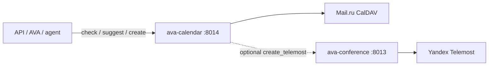

# Architecture: Calendar service

## Boundary

| Owns | Does not own |
|------|----------------|
| Slot check / suggest | SMTP welcome PDF (mailer) |
| Create CalDAV events | Bitrix outreach |
| Optional Telemost via conference/ | Asterisk / AVA docker |
| Mail.ru credentials | Polyhub trading |

## Compatibility

Same routes as legacy mailer calendar API so AVA tools can switch base URL from `:8000` → `:8014` with minimal change.
