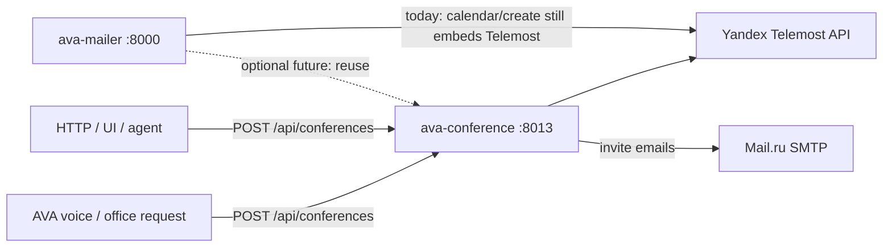

# Architecture: Conference service



## Boundary

| Owns | Does not own |
|------|----------------|
| Telemost create | Bitrix outreach |
| Invite emails | Asterisk / AVA docker |
| Yandex OAuth for Telemost | Polyhub trading |
| On-demand conference API | Full CalDAV scheduling (stays in mailer for now) |

## Request example (office)

«Срочно создай конференцию, пригласи Петра на petrov@firm.ru»

→ tool args:

```json
{
  "title": "Срочный созвон с Петром",
  "invitees": ["petrov@firm.ru"],
  "when_text": "сейчас",
  "message": "По запросу из офиса"
}
```
