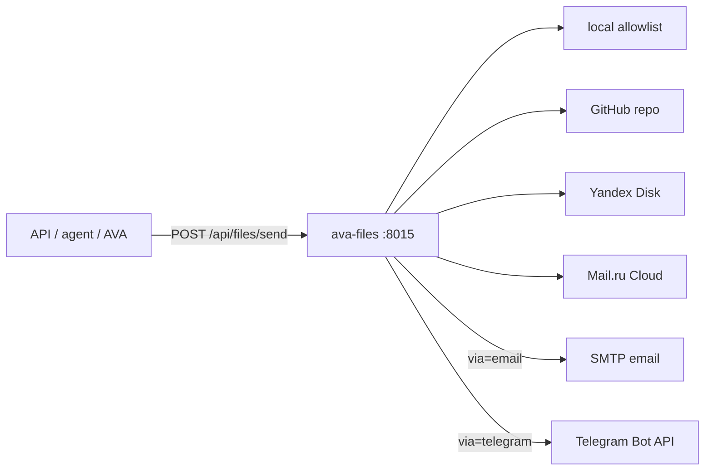

# Architecture: Files broker

## Boundary

| Owns | Does not own |
|------|----------------|
| Fetch + send files | Bitrix outreach sequences |
| Source adapters | Asterisk / AVA docker |
| Allowlist / size limits | Polyhub trading |
| Email+TG delivery of attachments | Full CRM |

## Safety

- Local paths must stay under `FILES_LOCAL_ALLOWLIST`
- `FILES_MAX_BYTES` caps payload (Telegram-friendly)
- Tokens only in `.env`
