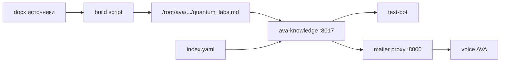

# ADR-0001: Quantum Labs Second Brain — корпоративная платформа знаний

- **Status:** Accepted with required security amendments
- **Date:** 2026-07-23
- **Accepted:** 2026-07-23
- **Authors:** Knowledge Architect (Cursor agent) + Quantum Labs
- **Deciders:** владелец продукта / CTO
- **Supersedes:** ad-hoc `quantum_labs.md` + keyword search в `ava-mailer` / `ava-knowledge`
- **Related:** `knowledge/` (`ava-knowledge` `:8017`), voice AVA `/root/ava`, text-bot `:8011`
- **Security principle:** разделение доступа обеспечивается инфраструктурой **до** того, как модель увидит документ — не промптом и не самой LLM.

---

## 0. Approved architecture choices

| Решение | Выбор v1 |
|---------|----------|
| `vector_backend_v1` | **PostgreSQL + pgvector** (абстракция `VectorStore` сохраняется; Qdrant — только при измеримой проблеме производительности) |
| `graph_store_v1` | **PostgreSQL tables** (`entities`, `entity_aliases`, `edges`, `document_entities`, `entity_versions`); Neo4j не внедрять сейчас |
| `vault_location` | **Отдельный приватный репозиторий `quantum-brain`** (Vault); код платформы остаётся в текущем репозитории (`knowledge/platform/`) |
| `public_private_separation` | **Physical** — минимум `knowledge_public` и `knowledge_private` |
| `default_access` | **deny all** |
| `public_publish` | **manual-approval-only** |
| Voice/text switch | **Запрещён** без отдельного approval после Phase 0 security tests |

Реализация runtime (смена поискового движка / переключение агентов) начинается **только после** Phase 0 security tests и обновлённого ADR. Текущий production `:8017` keyword runtime **не меняется** в Phase 0.

---

## 1. Context — что есть сейчас

### 1.1. Инвентарь

| Компонент | Состояние |
|-----------|-----------|
| Сервис | `ava-knowledge` на `127.0.0.1:8017` (`/opt/ava-knowledge`) |
| Канон (фактически) | один файл `/root/ava/config/knowledge/quantum_labs.md` (~30k символов, 117 секций) |
| Копия в git | `knowledge/content/quantum_labs.md` |
| Каталог тем | `knowledge/content/index.yaml` (19 topic_id) |
| Источник сборки | docx → md скриптом `/root/ava/scripts/build_quantum_knowledge_base.py` (вне репо office) |
| Поиск | aliases + keyword score по H2/H3, без embeddings |
| Потребители | text-bot напрямую; voice AVA через mailer `:8000` proxy |
| ACL / visibility / tenant | нет |
| Graph / entities | нет |
| Vector DB | нет |
| MCP / LLM-agnostic API | только тонкий REST; tool-схемы заточены под OpenAI в text-bot |

### 1.2. Поток сегодня



### 1.3. Классификация текущего корпуса

Примерно: FAQ / продукт / legal-safety / sales-scripts / AVA-ops — всё в одном файле без `tenant_id`, `visibility`, `acl`, `classification`, без связей.

---

## 2. Problem

### 2.1. Главная задача (product mission)

Second Brain должен стать **операционной памятью офиса**, по которой в любой момент можно ответить на **любой рабочий или технический вопрос**:

| Что обязательно знать | Примеры вопросов |
|----------------------|------------------|
| **Контакты** | email, телефоны, должности, компании, роли в проектах |
| **Переписки** | темы входящих/исходящих писем, цепочки, договорённости, статусы |
| **Проекты и обсуждения** | решения, открытые вопросы, участники, следующие шаги |
| **Файлы на сервере** | договоры, спецификации, выгрузки, вложения, рабочие документы |
| **Продуктовый/операционный FAQ** | тарифы, процессы, AVA — как сейчас в `quantum_labs.md` |

База **растёт непрерывно**: каждое новое письмо, проект, обсуждение и файл на сервере должны попадать в корпус (через ingest + safety + ACL), а не оставаться только в почтовом ящике или на диске.

Cursor / office-агенты с достаточным principal должны уметь **проверять входящие и исходящие письма** и опираться на тот же индекс, что и люди.

FAQ-монолит — лишь стартовый слой. Без контактов, переписок и файлов миссия не выполнена.

### 2.2. Технические пробелы сейчас

Текущая Knowledge — **хороший FAQ-поиск для секретаря**, но не операционная память:

1. **Нет SoT-дисциплины** — dual path (`/root/ava` vs git vs `/opt`).
2. **Смешение аудиторий** — внутренние запреты рядом с клиентским FAQ; ACL отсутствует.
3. **Нет типизации**, графа контактов/проектов, hybrid search, indexer pipeline.
4. **Нет непрерывного ingest** почты, файлов сервера, протоколов обсуждений.
5. **Не LLM-agnostic** — нет единого MCP/API контракта с правами.
6. **Нет tenant isolation**, физической изоляции public/private, AI processing policy, secret scanning.

**Цель:** Second Brain — единый Source of Truth для AI-агентов и сотрудников Quantum Labs: контакты + переписки + проекты + файлы + FAQ, с tenant + ACL + classification, непрерывным ростом корпуса, физическим разделением индексов, hybrid search и обратимой миграцией без потери данных.

---

## 3. Decision drivers

| # | Драйвер |
|---|---------|
| D0 | **Ответ на любой рабочий/технический вопрос** из единого searchable корпуса (контакты, почта, проекты, файлы, FAQ) |
| D1 | Markdown / структурированные записи Vault = канон; vector/graph — производные индексы |
| D2 | Ноль потери информации; старые документы и переписки остаются доступны |
| D3 | **Security filtering внутри каждого backend-запроса**; post-filter — только доп. проверка |
| D4 | Не ломать voice (`:8000/api/knowledge/query`) и text-bot tools без отдельного approval |
| D5 | LLM-agnostic: любой агент (в т.ч. Cursor) через REST и/или MCP |
| D6 | Малые обратимые шаги + тесты + rollback |
| D7 | Не трогать Asterisk / Polyhub / Mango / VPN |
| D8 | Default deny; public только через manual publish |
| D9 | Не отправлять company/restricted/secret во внешние embedding/LLM API без явной policy |
| D10 | Vault и код платформы — разные репозитории и жизненные циклы |
| D11 | Корпус **растёт** из почты/файлов/обсуждений; ingest идемпотентен и аудируем |

---

## 4. Decision — целевая архитектура

### 4.1. Принцип: Vault + Indexes (+ physical security zones)

```
┌─────────────────────────────────────────────────────────┐
│  SOURCES (continuous growth)                              │
│  FAQ MD · Mail in/out · Server files · Meetings/projects │
└───────────────────────────┬─────────────────────────────┘
                            │ ingest + safety
┌───────────────────────────▼─────────────────────────────┐
│  KNOWLEDGE VAULT (private repo quantum-brain) — SoT     │
│  Markdown + contacts + threads + file manifests         │
└───────────────────────────┬─────────────────────────────┘
                            │ index pipeline
        ┌───────────────────┼───────────────────┐
        ▼                   ▼                   ▼
   Keyword/FTS          Vector Index         Knowledge Graph
   (Postgres)        (pgvector v1)     (contacts·projects·threads)
        └───────────────────┬───────────────────┘
                            ▼
   physical zones: knowledge_public | knowledge_private [| knowledge_secret]
                            ▼
              Search / RAG / Permission / MCP Gateway
                            ▼
   voice-* · text-secretary · outreach · cursor-admin · people
```

**Правило:** если vector и MD расходятся — прав MD, индексы пересобираются. Vector **никогда** не SoT.

**Prod:** read-only checkout или release bundle Vault из `quantum-brain`. Код платформы — в `quantum-office/knowledge/platform/`.

### 4.2. Расположение артефактов

```
quantum-office/                          # этот репозиторий
  knowledge/
    content/                             # TRANSITIONAL runtime :8017
    platform/                            # код Second Brain (схемы, ACL, indexer, …)
    vault/                               # TRANSITIONAL freeze/snapshots only
      legacy/                            # снимки для миграции (Phase 0)
  docs/architecture/

quantum-brain/                           # ОТДЕЛЬНЫЙ приватный репозиторий
  vault/                                 # канон знаний (products, meetings, …)
    _meta/
      taxonomy.yaml
      acl-roles.yaml
      service-principals.yaml
```

В этом репозитории Phase 0 держит freeze + схемы платформы; канонический Vault после Phase 1 живёт в `quantum-brain`.

### 4.3. Tenant isolation (обязательно)

Даже при одной компании сейчас:

- В frontmatter каждого документа: `tenant_id: quantum-labs` (или иной tenant).
- Во **всех** индексах, таблицах entities/edges, chunks, audit: колонка/поле `tenant_id`.
- Во всех API: **`tenant_id` не принимается произвольно из тела запроса**; определяется из токена principal (claims).
- Каждый поисковый запрос включает **mandatory** `tenant_id = …` filter.

Это защищает от смешивания корпусов при появлении дочерних компаний, клиентов, партнёров, white-label.

### 4.4. Документная модель + frontmatter (security-complete)

```yaml
---
id: kp-faq-commission-001
tenant_id: quantum-labs          # ОБЯЗАТЕЛЬНО
title: Какая комиссия?
type: faq
visibility: restricted           # public|company|team:<name>|restricted|secret
acl:
  allow_users: []                # user:denis
  allow_groups:                  # group:management
    - group:sales
  allow_services: []             # service:contract-analyzer
  deny_users: []
  deny_groups: []
classification:
  level: confidential            # public|internal|confidential|secret
  contains_personal_data: false
  contains_bank_secret: false
  contains_credentials: false
publication:
  status: unpublished            # unpublished|pending_review|published|revoked
  approved_by: null
  approved_at: null
  public_version: null
channels: []                     # office-assistant | outreach | …
ai_processing:
  external_llm_allowed: false
  external_embedding_allowed: false
  local_processing_required: true
owner: product
created: 2026-06-02
updated: 2026-07-23
tags: [tariffs, sbp]
entities: [product:quantum-payouts]
status: active                   # draft|active|deprecated|quarantine
version: 1
acl_revision: 1
source: legacy/quantum_labs.v1.md#8.5
---
```

**Инварианты ACL:**

- `visibility: restricted` **без** непустого `allow_users` / `allow_groups` / `allow_services` — **запрещён** (валидация отклоняет документ).
- `visibility: public` **нельзя** выставить классификатором; только через `publication.status: published` + `approved_by` / `approved_at`.
- Default для новых/сомнительных импортов: не выше `company`; при чувствительных данных — `restricted`.
- Default access для неизвестного principal: **deny all**.

**Типы (`type`)** минимум:  
`doc`, `api`, `sop`, `adr`, `research`, `meeting`, `protocol`, `email`, `email_thread`, `contact`, `file`, `discussion`, `idea`, `task`, `requirement`, `policy`, `company`, `bank`, `product`, `legal`, `article_public`, `article_internal`, `reference`, `faq`, `incident`, `timeline`.

### 4.5. Visibility + ACL + classification

| Layer | Назначение |
|-------|------------|
| `visibility` | грубый уровень (public / company / team / restricted / secret) |
| `acl` | явные allow/deny для users, groups, **services** |
| `classification` | PII / bank secret / credentials — влияет на AI processing и quarantine |
| `channels` | куда документ можно отдавать (например `office-assistant`), отдельно от company |

`restricted` без конкретного allow-list **ничего не означает** и поэтому запрещён.

Голосовой бот, Cursor и внутренний аналитик — **разные** service principals с разными правами.

### 4.6. Security search pipeline (обязательный)

```
Authenticate principal
        ↓
Resolve tenant + user + groups + service identity
        ↓
Build mandatory ACL filter (+ tenant_id)
        ↓
Keyword search  WITH ACL filter   (Postgres FTS)
Vector search   WITH ACL filter   (pgvector)
Graph traversal WITH ACL filter   (Postgres)
        ↓
Fusion/rerank только разрешённых результатов
        ↓
Defense-in-depth post-filter (доп. проверка, не основной механизм)
        ↓
Context assembly
        ↓
LLM
```

**Запрещено:**

```
найти top-100 по всей базе → потом отфильтровать запрещённое
```

Почему:

- запрещённый документ влияет на ранжирование;
- утечка через score, titles, snippets, telemetry;
- после фильтра может не остаться результатов;
- кеш может содержать смешанные данные.

**Закреплено:** каждый backend обязан выполнять security filtering **непосредственно в запросе**. Post-filtering — только дополнительная защитная проверка.

### 4.7. ACL на документах и chunks

Каждый chunk **наследует** ACL исходного документа:

```json
{
  "chunk_id": "doc-123:chunk-04",
  "document_id": "doc-123",
  "tenant_id": "quantum-labs",
  "visibility": "team",
  "allowed_group_ids": ["sales"],
  "classification": "confidential",
  "acl_revision": 3,
  "document_status": "active",
  "document_version": 2,
  "embedding": []
}
```

Нельзя индексировать chunk без: `tenant_id`, `document_id`, `acl_revision`, уровня конфиденциальности, статуса документа, версии документа.

При изменении ACL документа все его chunks **транзакционно** обновляются или переиндексируются (документ + chunks + ACL в одной транзакции Postgres).

### 4.8. Физическое разделение индексов

| Index | Содержимое | Кто имеет credentials / сеть |
|-------|------------|------------------------------|
| `knowledge_public` | только `publication.status: published` | публичные агенты (`voice-public`) |
| `knowledge_private` | company / team / restricted | внутренний gateway |
| `knowledge_secret` (рекомендуется) | особо чувствительные | отдельные ключи и service accounts |

Минимум — **два** индекса: `knowledge_public` и `knowledge_private`.

Публичный бот **не должен** иметь сетевого доступа или credentials к private index. Ошибка одного metadata-фильтра не должна открыть корпоративные документы публичному боту.

### 4.9. Manual publish only

```
Новый документ
    ↓
visibility = restricted или company  (не public)
    ↓
review
    ↓
явное действие publish (approved_by, approved_at)
    ↓
publication.status = published
    ↓
копирование / индексация в knowledge_public
```

Автоматический классификатор **не может** назначить `public` / опубликовать документ.

### 4.10. AI processing policy

```yaml
ai_processing:
  external_llm_allowed: false
  external_embedding_allowed: false
  local_processing_required: true
```

| Класс | Embeddings | LLM extraction |
|-------|------------|----------------|
| public | внешний API допустим | допустим |
| company | утверждённый провайдер или локально | по политике |
| restricted | **локально** | локально или отключено |
| secret | локально либо **без** embeddings | только вручную / локально |

Особенно нельзя передавать наружу: токены, пароли, ключи API, банковские документы, клиентские реестры, ПДн, условия договоров (если запрещено политикой).

### 4.11. Safety pipeline перед индексацией

```
Document
   ↓
Secret scanner
   ↓
PII detector
   ↓
Credential detector
   ↓
Classification policy
   ↓
Index  OR  quarantine (status: quarantine)
```

Минимально: API keys, JWT, пароли, private keys, connection strings, банковские реквизиты, телефоны/email, паспортные данные, номера счетов/карт.

При обнаружении credentials документ **не** индексируется автоматически → quarantine.

### 4.12. Service principals и default deny

| Principal | Доступ |
|-----------|--------|
| `service:voice-public` | только опубликованный `public` (`knowledge_public`) |
| `service:voice-office` | public + коллекция/канал `assistant-safe` |
| `service:text-secretary` | public + `assistant-safe` |
| `service:outreach` | public + `team:sales` (по каналу `outreach`) |
| `service:cursor-admin` | только при персональной авторизации администратора |
| неизвестный | **deny all** |

**Нельзя** давать voice/text общий blanket-доступ ко всему уровню `company`. Не каждый company-документ разрешено озвучивать по телефону → метка `channels` / коллекция `assistant-safe`.

### 4.13. Cache isolation

**Запрещено:** `cache_key = hash(query)`.

**Обязательно:**

```
cache_key = hash(
  tenant_id,
  principal_id,
  groups,
  permission_revision,
  query,
  search_mode,
  index_revision
)
```

Либо кешировать только результаты, безопасные для одного уровня доступа. LLM response cache также разделён по security context.

### 4.14. Audit logging (без полного закрытого текста)

```json
{
  "principal_id": "user:123",
  "tenant_id": "quantum-labs",
  "query_hash": "...",
  "query_preview_redacted": "...",
  "retrieved_doc_ids": [],
  "denied_doc_count": 0,
  "purpose": "assistant-query",
  "timestamp": "...",
  "request_id": "..."
}
```

Полный запрос — только при необходимости и с ограниченным сроком хранения. Обычный audit log **не** хранит чувствительный полный текст.

### 4.15. Entity Graph (Postgres v1) — контакты и проекты в центре

Таблицы:

```
entities (
  id, tenant_id, kind, canonical_name, metadata,
  visibility, created_at, updated_at
)
entity_aliases (...)
edges (
  id, tenant_id, source_entity_id, target_entity_id,
  relation_type, source_document_id, confidence,
  review_status, visibility
)
document_entities (...)
entity_versions (...)
contacts (  -- специализированная проекция Person/Company
  id, tenant_id, display_name, emails[], phones[],
  title, company_entity_id, visibility, acl_revision, ...
)
threads (
  id, tenant_id, subject, channel, project_entity_id,
  participants[], last_message_at, visibility, ...
)
```

**Обязательные kinds:** `Person`, `Company`, `Product`, `Project`, `Decision`, `Research`, `Meeting`, `Article`, `API`, `Incident`, `Idea`, `TimelineEvent`, `EmailThread`, `Mailbox`, `FileAsset`, `Discussion`.

**Обязательные связи (пример):**  
`WORKS_AT`, `HAS_TITLE`, `EMAIL_OF`, `PHONE_OF`, `PARTICIPANT_OF`, `DISCUSSED_IN`, `DECIDED_IN`, `ATTACHED_TO`, `PART_OF_PROJECT`, `FOLLOWS_UP`, `SUPERSEDES`, `OWNED_BY`, `MENTIONS`.

Все graph queries — с `tenant_id` + ACL filter в SQL.

Контакты с ПДн: `classification.contains_personal_data: true`, default visibility не выше `company` / чаще `restricted`; **никогда** не в `knowledge_public` без manual publish (обычно publish запрещён для ПДн).

### 4.16. Операционный корпус: почта, файлы, обсуждения

```
Mailboxes (in/out)          Server files / attachments
        │                              │
        ▼                              ▼
   Mail Ingestor                  File Ingestor
        │                              │
        └──────────┬───────────────────┘
                   ▼
         Safety scan + classify
                   ▼
     Thread / Contact / Project extract
                   ▼
         Vault records (quantum-brain)
                   ▼
     Index → FTS + pgvector + Graph (ACL)
```

**Правила ingest:**

1. **Входящие и исходящие** письма индексируются (идемпотентно по `Message-ID` / hash).
2. Из письма извлекаются: тема, участники → **upsert контактов** (email, ФИО, компания, должность если есть), project/topic tags, вложения → File Ingestor.
3. Файлы на сервере (разрешённые roots, напр. office shares / mail attachments store) сканируются по mtime/hash; путь и метаданные в `FileAsset`.
4. Обсуждения проектов (протоколы, meeting notes, chat exports при политике) → `Discussion` / `Meeting` документы, связанные с `Project`.
5. Default visibility для почты/файлов: **`restricted` или `company`**, не `public`. ПДн/секреты → safety → quarantine или `restricted` + allow-list.
6. Рост корпуса — норма: indexer работает непрерывно (cron/watcher), без ручного копирования FAQ.
7. Cursor / `service:cursor-admin` (с персональной admin-авторизацией) и office principals с ACL могут **искать по письмам и файлам** через MCP/`kb.search` — в пределах прав, не «весь ящик в промпт».

**Ответ на рабочий вопрос** = hybrid retrieve по FAQ + threads + contacts + files + graph expand (участники ↔ компания ↔ проект ↔ письма).

### 4.17. Сервисы (логические границы)

| Service | Responsibility | Interface |
|---------|----------------|-----------|
| **Storage** | Vault FS/Git (`quantum-brain`), versions | `DocsRepository` |
| **Permission** | principal → ACL filter; `can_read` | mandatory pre-query filter builder |
| **Safety** | secret/PII/credential scan → quarantine | `scan(doc)` |
| **Mail Ingestor** | IMAP/API in+out → threads + contacts | `ingest_mailbox(since)` |
| **File Ingestor** | server roots / attachments → FileAsset | `ingest_paths(roots)` |
| **Contact Directory** | canonical people/companies phones/emails/titles | `upsert_contact`, `find_contact` |
| **Indexer** | normalize → chunk → embed (по policy) → upsert | pipeline events |
| **Embedding** | pluggable; respects `ai_processing` | `embed(texts[], policy)` |
| **Entity Extractor** | candidates + review queue | `extract(doc)` |
| **Graph** | Postgres tables | `GraphStore` |
| **Vector Index** | pgvector v1 | `VectorStore` |
| **Search** | FTS + vector + graph **with in-query ACL** | `search(q, principal, mode)` |
| **RAG** | assemble only allowed context | `retrieve(q, principal, budget)` |
| **API Gateway** | REST + MCP; tenant from token | OpenAPI + MCP |
| **Compat Adapter** | legacy `/api/knowledge/query|topics|get` | без switch без approval |
| **Admin UI** | browse, ACL, reindex, publish approval, quarantine | later |

Modular monolith first: `knowledge/platform/`.

### 4.18. Chunking / search modes / MCP

Смысловой chunking (в т.ч. email = thread segment / message; file = section by type); modes `keyword | semantic | hybrid`; MCP tools:

- `kb.search` / `kb.get` / `kb.related` / `kb.upsert` / `kb.reindex`
- `kb.find_contact` `{name|email|phone|company}`
- `kb.list_threads` `{project|participant|since}`
- `kb.ingest_status`

Всегда с principal из gateway auth. Compat API сохраняется; **переключение** voice/text на новую платформу — только после отдельного approval. Голосовой `voice-public` **не** получает почту/ПДн.

---

## 5. Consequences

### Positive

- Единая память с инфраструктурным ACL (не «на честном слове» LLM)
- Tenant + physical index separation → граница при ошибке фильтра
- Manual publish + secret scan → меньше случайных утечек
- pgvector + Postgres graph → меньше компонентов, транзакционный ACL
- Vault в отдельном repo → код ≠ договоры/клиентские материалы

### Negative / costs

- Выше сложность frontmatter и indexer
- Два+ физических индекса и раздельные credentials
- Локальные embeddings для restricted/secret
- Отдельный lifecycle `quantum-brain`

### Risks

| Risk | Mitigation |
|------|------------|
| Сломать voice/text | Compat + no switch без approval; e2e контракты |
| Утечка через post-filter / cache / audit | in-query ACL; principal-scoped cache; redacted audit |
| Внешний embedding уносит секреты | AI processing policy + quarantine |
| Dual SoT drift | Vault SoT в `quantum-brain`; prod = release bundle |
| Over-engineering | pgvector/Postgres v1; Qdrant/Neo4j отложены |

---

## 6. Alternatives considered

| Alternative | Why rejected / deferred |
|-------------|-------------------------|
| Только visibility без ACL | `restricted` бессмысленен без allow-list; нет service principals |
| Post-filter после top-k | утечки через ranking/snippets/cache; закреплено как запрет |
| Один логический индекс public+private | ошибка фильтра = утечка; нужен physical split |
| Vault внутри app repo | риск попадания знаний в image/CI; разные ACL жизненных циклов |
| Qdrant / Neo4j в v1 | избыточно при текущем объёме; Postgres уже нужен для ACL/audit |
| Blanket `company` для voice/text | озвучивание закрытых company-доков по телефону |
| Auto-publish public | классификатор не должен публиковать |

---

## 7. Migration principles (no data loss)

1. **Copy, never delete** — `vault/legacy/quantum_labs.v1.md` = полный снимок.  
2. **Import manifest** — секция → путь + `source`.  
3. **Dual-read period** — feature flag; Phase 0 **не** меняет production runtime.  
4. **Compat API** зелёный в CI.  
5. **Rollback** = legacy MD / выключить flag.  
6. **Import visibility default:** не выше `company`; чувствительное → `restricted`; `public` только после manual publish.  
7. **Phase 0 security tests** обязательны до любой реализации indexer/RAG.

---

## 8. Out of scope (для ADR)

- Полный Admin UI в первой волне  
- Замена Bitrix CRM как системы продаж (Second Brain **дополняет** CRM памятью/поиском, не обязан заменить UI Bitrix в v1)  
- Обучение собственных embedding-моделей  
- Qdrant / Neo4j в v1  
- Переключение voice/text на Second Brain без отдельного approval  
- Публикация ПДн/переписки в `knowledge_public`  
- Ingest почты/файлов **без** ACL, safety scan и tenant isolation  

**В scope (явно):** непрерывный ingest входящей/исходящей почты, контактов, серверных файлов и проектных обсуждений — под security policy ADR.  

---

## 9. Approval gate — RESOLVED

| Вопрос | Решение |
|--------|---------|
| Vector backend v1 | **pgvector** (абстракция `VectorStore` сохранена) |
| Graph store v1 | **PostgreSQL tables** (абстракция `GraphStore` сохранена) |
| Vault location | **separate-private-repository `quantum-brain`** |
| Public/private | **physical** (`knowledge_public` / `knowledge_private`) |
| Default access | **deny all** |
| Public publish | **manual-approval-only** |
| Office agents | отдельные service principals; **не** blanket company; канал `assistant-safe` |
| Start implementation | только после Phase 0 security tests; **без** смены prod runtime в Phase 0 |

---

## 10. References

- Current service: `knowledge/README.md`  
- Topic catalog: `knowledge/content/index.yaml`  
- Roadmap: `docs/architecture/SECOND_BRAIN_ROADMAP.md`  
- Operational memory mission: `docs/architecture/OPERATIONAL_MEMORY.md`  
- Platform schemas: `knowledge/platform/schemas/`  
- Security contracts/tests: `knowledge/platform/tests/`  
- Prod constraints: `AGENTS.md`
