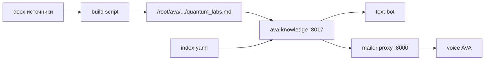

# ADR-0001: Quantum Labs Second Brain — корпоративная платформа знаний

- **Status:** Proposed (ожидает утверждения; реализация НЕ начата)
- **Date:** 2026-07-23
- **Authors:** Knowledge Architect (Cursor agent) + Quantum Labs
- **Deciders:** владелец продукта / CTO
- **Supersedes:** ad-hoc `quantum_labs.md` + keyword search в `ava-mailer` / `ava-knowledge`
- **Related:** `knowledge/` (`ava-knowledge` `:8017`), voice AVA `/root/ava`, text-bot `:8011`

---

## 1. Context — что есть сейчас

### 1.1. Инвентарь

| Компонент | Состояние |
|-----------|-----------|
| Сервис | `ava-knowledge` на `127.0.0.1:8017` (`/opt/ava-knowledge`) |
| Канон (фактически) | один файл `/root/ava/config/knowledge/quantum_labs.md` (~30k символов, 117 секций) |
| Копия в git | `knowledge/content/quantum_labs.md` |
| Каталог тем | `knowledge/content/index.yaml` (19 topic_id) |
| Источник сборки | docx → md скриптом `/root/ava/scripts/build_quantum_knowledge_base.py` (вне репо office) |
| Поиск | aliases + keyword score по H2/H3, без embeddings |
| Потребители | text-bot напрямую; voice AVA через mailer `:8000` proxy |
| ACL / visibility | нет |
| Graph / entities | нет |
| Vector DB | нет |
| MCP / LLM-agnostic API | только тонкий REST; tool-схемы заточены под OpenAI в text-bot |

### 1.2. Поток сегодня



### 1.3. Классификация текущего корпуса (эвристика по заголовкам)

Примерно: FAQ / продукт / legal-safety / sales-scripts / AVA-ops — всё в одном файле без `visibility`, без `type`, без связей.

---

## 2. Problem

Текущая Knowledge — **хороший FAQ-поиск для секретаря**, но не корпоративная память:

1. **Нет SoT-дисциплины** — dual path (`/root/ava` vs git vs `/opt`), непонятно, куда писать.
2. **Смешение аудиторий** — внутренние запреты («чего не говорить») лежат рядом с клиентским FAQ; ACL отсутствует → риск утечки при росте корпуса.
3. **Нет типизации** — нельзя отличить ADR от протокола встречи, договора, API-спеки.
4. **Нет графа** — «Сбер ↔ номинальный счёт ↔ клиент ↔ встреча» не моделируется.
5. **Поиск слабый** — только keyword/alias; нет semantic/hybrid.
6. **Нет пайплайна** — нет normalize → chunk → embed → graph → index.
7. **Не LLM-agnostic** — каждый агент сам знает HTTP/tool names; нет единого MCP/API контракта с правами.

**Цель:** превратить `knowledge/` в **Second Brain** — единый Source of Truth для всех AI-агентов Quantum Labs, с visibility, графом, hybrid search и обратимой миграцией без потери данных.

---

## 3. Decision drivers

| # | Драйвер |
|---|---------|
| D1 | Markdown = канон; vector/graph — производные индексы |
| D2 | Ноль потери информации; старые документы остаются доступны |
| D3 | Visibility обязателен; фильтр ACL **до** выдачи в LLM |
| D4 | Не ломать voice (`:8000/api/knowledge/query`) и text-bot tools |
| D5 | LLM-agnostic: любой агент через REST и/или MCP |
| D6 | Малые обратимые шаги + тесты + rollback |
| D7 | Не трогать Asterisk / Polyhub / Mango / VPN |

---

## 4. Decision — целевая архитектура

### 4.1. Принцип: Vault + Indexes

```
┌─────────────────────────────────────────────────────────┐
│  KNOWLEDGE VAULT (Git + FS) — Source of Truth           │
│  Markdown + YAML frontmatter + attachments              │
└───────────────────────────┬─────────────────────────────┘
                            │ index pipeline
        ┌───────────────────┼───────────────────┐
        ▼                   ▼                   ▼
   Keyword/FTS          Vector Index         Knowledge Graph
   (pg / meili)      (pgvector|Qdrant)     (entities+edges)
        └───────────────────┬───────────────────┘
                            ▼
              Search / RAG / Permission / MCP Gateway
                            ▼
         voice · text-bot · outreach · Cursor · другие агенты
```

**Правило:** если vector и MD расходятся — прав MD, индексы пересобираются. Vector **никогда** не SoT.

### 4.2. Целевое дерево Vault (предложение)

```
knowledge/
  vault/                          # канон (git)
    _meta/
      taxonomy.yaml               # types, visibility levels, entity kinds
      acl-roles.yaml              # role → allowed visibility
    legacy/                       # неизменяемый архив импорта
      quantum_labs.v1.md          # полный исходный монолит
      import-manifest.yaml        # карта секция → новый путь
    products/
      quantum-payouts/
      quantum-outreach/
      ava/
    companies/
    people/
    projects/
    decisions/adr/
    research/
    meetings/
    articles/
      public/
      internal/
    apis/
    incidents/
    ideas/
    requirements/
    policies/                     # регламенты
    legal/
    timeline/
  content/                        # TRANSITIONAL (текущий runtime для :8017)
    quantum_labs.md
    index.yaml
  services/                       # код платформы (поэтапно)
    ...
```

Старые материалы **не удаляются**: полный монолит живёт в `vault/legacy/`; шарды — производные с `source:` ссылкой на legacy.

### 4.3. Документная модель + frontmatter

Каждый канонический MD:

```yaml
---
id: kp-faq-commission-001
title: Какая комиссия?
type: faq                 # см. taxonomy
visibility: company       # ОБЯЗАТЕЛЬНО
owner: product
created: 2026-06-02
updated: 2026-07-23
tags: [tariffs, sbp]
entities: [product:quantum-payouts]
projects: [quantum-payouts]
companies: []
people: []
status: active            # draft|active|deprecated
version: 1
source: legacy/quantum_labs.v1.md#8.5
---
```

**Типы (`type`)** минимум:  
`doc`, `api`, `sop`, `adr`, `research`, `meeting`, `protocol`, `email`, `idea`, `task`, `requirement`, `policy`, `company`, `bank`, `product`, `legal`, `article_public`, `article_internal`, `reference`, `faq`, `incident`, `timeline`.

### 4.4. Visibility (обязательно)

| Level | Кто видит |
|-------|-----------|
| `public` | все агенты / публичные каналы |
| `company` | сотрудники Quantum Labs |
| `team:<name>` | команда (finance, legal, eng, …) |
| `restricted` | allow-list пользователей |
| `secret` | только admins |

**Инвариант поиска:**  
`allowed = PermissionService.resolve(principal)` →  
`Search.filter(visibility ∈ allowed)` → **только потом** chunk’и в LLM.

Лог: `principal`, `query`, `doc_ids`, `visibility`, `ts` (audit).

### 4.5. Entity Graph

Сущности: `Company`, `Person`, `Product`, `Project`, `Decision`, `Research`, `Meeting`, `Article`, `API`, `Incident`, `Idea`, `TimelineEvent`.

Связи (пример): `USES`, `PARTNER_OF`, `DISCUSSED_IN`, `DECIDED_IN`, `SUPERSEDES`, `OWNED_BY`, `MENTIONS`.

Извлечение: сначала rules/frontmatter; затем LLM-extractor с human review queue для `secret/restricted`.

### 4.6. Сервисы (логические границы)

| Service | Responsibility | Interface |
|---------|----------------|-----------|
| **Storage** | Vault FS/Git, read/write docs, versions | `DocsRepository` |
| **Permission** | principal → visibility set; doc ACL check | `can_read(principal, doc)` |
| **Indexer** | watch/commit → normalize → chunk → publish jobs | pipeline events |
| **Embedding** | text → vector (model pluggable) | `embed(texts[])` |
| **Entity Extractor** | doc → entities+edges candidates | `extract(doc)` |
| **Graph** | store/query entities & relations | `GraphStore` |
| **Vector Index** | abstract backend | `VectorStore` (pgvector \| Qdrant) |
| **Search** | keyword + semantic + hybrid + graph expand | `search(q, principal, mode)` |
| **RAG** | assemble allowed context for agents | `retrieve(q, principal, budget)` |
| **API Gateway** | REST + MCP tools | OpenAPI + MCP |
| **Admin UI** | browse, ACL, reindex, review extractions | later phase |
| **Compat Adapter** | legacy `/api/knowledge/query|topics|get` | сохраняет voice/text |

На старте допустимо **modular monolith** (`knowledge/platform/`) с чёткими пакетами = сервисы; вынос в процессы — после стабилизации контрактов.

### 4.7. Chunking (смысловой)

| Тип | Граница chunk |
|-----|----------------|
| Article/doc | H2/H3 |
| API | endpoint / method |
| Meeting | agenda item / decision / action |
| ADR | Context / Decision / Consequences |
| Code (если появится) | class/function |
| Legacy FAQ | один «Вопрос/Ответ» |

Запрещено: тупой split по N символов как единственная стратегия.

### 4.8. Search modes

1. **Keyword** — FTS по title/body/tags  
2. **Semantic** — top-k по embeddings  
3. **Hybrid** — fusion (RRF) + optional graph expansion  
Все три — **после** ACL filter (или с filter в самом запросе к индексу, где visibility — обязательное поле).

### 4.9. LLM-agnostic / MCP

Единый контракт для Cursor, Claude, GPT, внутренних агентов:

MCP tools (минимум):
- `kb.search` `{query, mode, limit}` — уже отфильтровано по principal
- `kb.get` `{id}`
- `kb.list_entities` / `kb.related`
- `kb.upsert` (только роли с write)
- `kb.reindex` (admin)

Principal передаётся через gateway auth (service token + user/role claims), не «на честном слове» промпта.

### 4.10. Compat layer (критично для миграции)

Пока существует Second Brain, **legacy API остаётся**:

- `POST /api/knowledge/query` → внутри вызывает `RAG.retrieve` с principal=`voice|secretary|...` и visibility policy по умолчанию (`company` для office agents, без `secret`)
- `GET /api/knowledge/topics` → виртуальный каталог из taxonomy + tags
- mailer proxy без изменений контракта ответа (`ok/topic/text/chars`)

---

## 5. Consequences

### Positive

- Единая память для всех агентов  
- Контролируемые утечки (visibility)  
- Масштабируемый корпус (встречи, ADR, клиенты)  
- Смена LLM/vector backend без переписывания агентов  

### Negative / costs

- Сложность выше, чем у одного MD  
- Нужна дисциплина frontmatter и review extractor’а  
- Инфра: Postgres (±pgvector) или Qdrant  
- Миграция монолита — ручная классификация + авто-шард  

### Risks

| Risk | Mitigation |
|------|------------|
| Сломать voice/text | Compat adapter + e2e контрактные тесты |
| Утечка secret в public RAG | ACL до поиска; audit log; тесты на negative retrieval |
| Dual SoT drift | один Vault в git; `/root/ava/...` становится read-only mirror или symlink на legacy export |
| Over-engineering | phased roadmap; modular monolith first |

---

## 6. Alternatives considered

| Alternative | Why rejected / deferred |
|-------------|-------------------------|
| Только улучшить keyword в `:8017` | Не закрывает ACL/graph/LLM-agnostic |
| Notion/Confluence as SoT | Хуже для git/agents; vendor lock; сложнее ACL в RAG |
| Vector-only DB as SoT | Нарушает требование «MD канон» |
| Отдельная KB на каждого агента | Дубли и рассинхрон — антицель |
| Сразу микросервисы в k8s | Слишком рано; сначала контракты |

---

## 7. Migration principles (no data loss)

1. **Copy, never delete** — `vault/legacy/quantum_labs.v1.md` = полный байт-в-байт снимок.  
2. **Import manifest** — каждая секция → новый путь + `source` anchor; можно восстановить.  
3. **Dual-read period** — runtime читает legacy OR vault shards; feature flag.  
4. **Compat API** всегда зелёный в CI.  
5. **Rollback** = выключить flag, снова только legacy MD.  
6. **Visibility default при импорте:**  
   - sales FAQ / product → `company` (не `public`, пока не review)  
   - «чего не говорить», internal scripts → `company` или `team:sales`  
   - contacts/ops AVA → `team:ops`  
   - всё сомнительное → `restricted` до разбора  

---

## 8. Out of scope (для ADR)

- Полный Admin UI в первой волне  
- Автоматический импорт всей почты/Bitrix без политики  
- Замена Bitrix CRM  
- Обучение собственных embedding-моделей  

---

## 9. Approval gate

**Реализация начинается только после явного утверждения** этого ADR (статус → Accepted) и выбора:

- [ ] Vector backend v1: `pgvector` / `Qdrant` / отложить vectors до Phase 2  
- [ ] Graph store v1: Postgres tables / Neo4j / отложить graph до Phase 2  
- [ ] Где живёт Vault: этот репозиторий `knowledge/vault` / отдельный `quantum-brain` repo  
- [ ] Default visibility policy для office agents (voice/text)

---

## 10. References

- Current service: `knowledge/README.md`  
- Topic catalog: `knowledge/content/index.yaml`  
- Roadmap: `docs/architecture/SECOND_BRAIN_ROADMAP.md`  
- Prod constraints: `AGENTS.md`
