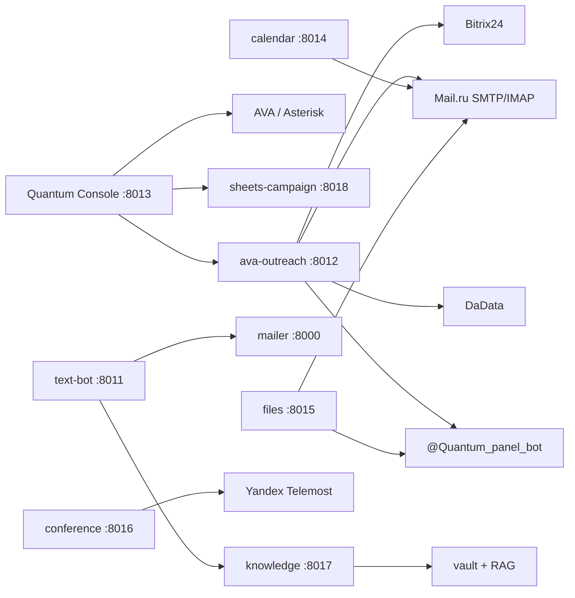

# AS-IS — Quantum Console / Office stack

**Дата аудита:** 2026-08-23  
**Основание:** репозиторий `quantum-office`, прод `5.35.86.62`, ветка Layers A–G3 (outreach control plane).  
**Связанное ТЗ:** `Quantum_Console_AI_Revenue_OS_Cursor_Spec.md` v1.1.

---

## 1. Что это сейчас

Набор **office-сервисов** одного оператора Quantum Labs (не multi-tenant SaaS):

- B2B email outreach по базе ломбардов (~1785 компаний);
- голос AVA / Asterisk / Mango;
- Telegram-секретарь и ops-бот Quantum Panel;
- календарь / Телемост / файлы;
- Second Brain (knowledge RAG).

**Не является:** единым AI Revenue OS, Identity Graph, Social Intelligence, Content/Video Studio, Revenue Orchestrator.

---

## 2. Карта сервисов

| Сервис | Путь | Порт | systemd | Роль |
|--------|------|------|---------|------|
| Outreach | `outreach/` | 8012 | `ava-outreach` | Email sequences, inbox, consent, Bitrix |
| Console | `console/` | 8013 | `quantum-console` | Пульт: линия, сценарии, звонки, proxy outreach |
| Knowledge | `knowledge/` | 8017 | `ava-knowledge` | KB + Second Brain RAG |
| Mailer | `mailer/` | 8000 | `ava-mailer` | Post-call + legacy calendar/Telemost |
| Text-bot | `text-bot/` | 8011 | `ava-text-bot` | Telegram AI-секретарь |
| Calendar | `calendar/` | 8014 | `ava-calendar` | CalDAV |
| Conference | `conference/` | 8016 | `ava-conference` | Телемост + invite |
| Files | `files/` | 8015 | `ava-files` | Брокер файлов |
| Sheets campaign | `sheets-campaign/` | 8018 | `ava-sheets-campaign` | Sheet → dial |

Прод-карта: `docs/PROD_MAP.md`, `AGENTS.md`.  
**Не трогать:** `/opt/polyhub`, Asterisk/AVA docker, Mango, VPN.

---

## 3. Outreach — ядро продаж (как есть)

### 3.1 Модули (`outreach/modules/`)

| Модуль | Сущности / таблицы | Назначение |
|--------|-------------------|------------|
| `clients` | `companies`, `contacts`, `client_emails` | Зеркало Bitrix + DaData (ИНН, город, TZ, директор) |
| `sequences` | `sequence_leads` | Цепочки 5 шагов, calendar API |
| `replies` | `reply_inbox`, `operator_replies` | IMAP inbox, thread, reply из UI |
| `consent` | `consent_ledger` | DNC / unsubscribe / bounce |
| `deliverability` | suppression, warmup, caps, pause | Anti-ban |
| `tracking` | `send_events` | Message-ID, opens, bounce |
| `analytics` | — | Funnel + step conversion |
| `telephony` | — | Post-call → Bitrix |
| `runner` | — | Play / Pause / Stop |
| `dadata` | — | Enrichment |
| `verification`, `policy` | — | Проверки / политика компании |

Также: `outbox.py`, `sender.py`, `reply_watcher.py`, `company_card.py`, `ops_notify.py`, `callback_cta.py`.

### 3.2 Статусы (фактические)

| Слой | Значения |
|------|----------|
| Outbox | `pending`, `sending`, `sent`, `failed`, `skipped`, `dry_run`, `replied`, `bounced`, `cancelled` |
| Sequences | `active`, `paused`, `stopped`, `completed` |
| Consent | `allowed`, `outreach`, `unsubscribed`, `bounced`, `manual_dnc`, `replied`, `callback` |
| Reply class | `positive_interest`, `human_unclassified`, `negative`, `ooo`, `bounce`, `unsubscribe`, … |
| Canonical CRM (`NEW`…`BLACKLISTED`) | **Только в vault KB**, не в коде/БД |

### 3.3 UI / API оператора (Layers A–G3)

- Вкладки: Кампания · Очередь · Входящие · Результат · Клиенты · Настройки
- Company card, bulk queue, 14-day calendar API
- Inbox thread + reply (`GET/POST …/inbox/{id}/thread|reply`)
- Quantum Panel notify (email + Telegram + on-call webhook)
- Console: health watcher + call_history notify

Статика: `outreach/static` → `console/static/outreach`.

---

## 4. Console / AVA / звонки

- `console/main.py`: линия AstDB, сценарии YAML, `/api/calls`, Mango callback, ARI dial, proxy `/api/outreach/*`
- Транскрипты: `/root/ava/data/call_history.db` (`call_records`) — **вне репо**
- Auth: `CONSOLE_TOKEN` / session cookie — **один оператор**
- Panel notify: `POST outreach/api/ops/notify`

---

## 5. Second Brain (knowledge)

| Компонент | Путь | Статус |
|-----------|------|--------|
| Runtime RAG | `knowledge/brain_platform/` | Реализован (FTS + embeddings + RRF) |
| API | `/api/brain/*`, legacy `/api/knowledge/*` | Работает |
| Schema | `documents`, `chunks`, `contacts`, `threads`, `emails`, `entities`, `edges` + `tenant_id` | Tenant-ready, прод = `quantum-labs` |
| Vault | `knowledge/vault/quantum-brain/` | Obsidian-shards + ACL |
| ADR в `docs/architecture/` | — | **Отсутствовали** до этого Stage 0 |

Second Brain = **источник знаний**, не CRM SoT.

---

## 6. Интеграции — факт

| Интеграция | Где | Режим |
|------------|-----|-------|
| Bitrix24 webhook | outreach | CRM mirror + deals/timeline |
| Mail.ru SMTP/IMAP | outreach, mailer, calendar, files | Отправка + входящие |
| DaData | outreach | INN → FIO / geo / TZ |
| Telegram Bot | text-bot, ops_notify, files | Секретарь + Panel + доставка |
| Asterisk / AVA | console, `/root/ava` | Голос |
| Mango VPBX | console | SIP + callback API |
| Yandex Telemost | conference, mailer legacy | Встречи |
| Google Sheets | sheets-campaign | Обзвон из таблицы |
| YaDisk / Mail.ru WebDAV | files | Файлы |
| OpenAI | text-bot, knowledge embeddings, mailer | LLM / embed |

---

## 7. Социальные сети

| Сеть | Код | Примечание |
|------|-----|------------|
| Telegram | ✅ | Bot API (секретарь, Panel, files) |
| VK / OK / TenChat / LinkedIn / MAX | ❌ | Нет адаптеров / stubs |
| WhatsApp | ❌ | Только шаблоны в KB |

---

## 8. Auth / tenancy

- Outreach: один `OUTREACH_UI_TOKEN`
- Console: один `CONSOLE_TOKEN` / password
- Остальные: `WEBHOOK_TOKEN`
- Brain: `tenant_id` в схеме, деплой single-tenant

**Не SaaS multi-tenant.** Один инстанс Quantum Labs.

---

## 9. Что переиспользовать (вердикт)

| Домен | Решение |
|-------|---------|
| Email outreach engine | **Reuse** — outbox, sequences, deliverability, geo windows |
| IMAP inbox + reply | **Reuse** — `modules/replies` + reply_watcher |
| Consent / suppression | **Reuse** — ledger + CSV; маппить на BLACKLISTED |
| Calls | **Reuse** — console + call_history + telephony module |
| Knowledge / RAG | **Reuse** — Second Brain as knowledge plane |
| Account / Person | **Wrap + extend** clients.db → каноническая модель |
| Social Intelligence | **Greenfield** |
| Content / Video Studio | **Greenfield** |
| Revenue Orchestrator | **Greenfield** (поверх events) |
| Multi-tenant SaaS | **Later** (Этап 8 ТЗ) |

---

## 10. Риски AS-IS

1. `main` в git отстаёт от prod / feature branch — merge PR #10 обязателен до больших миграций.
2. Нет единой карточки Account/Person с lifecycle `NEW`…`BLACKLISTED`.
3. Bitrix — фактический SoT для компаний; локальный mirror частичный.
4. Нет event envelope / outbox pattern между сервисами.
5. Call history вне репозитория (зависимость от `/root/ava`).
6. Канонические статусы живут только в vault markdown.
