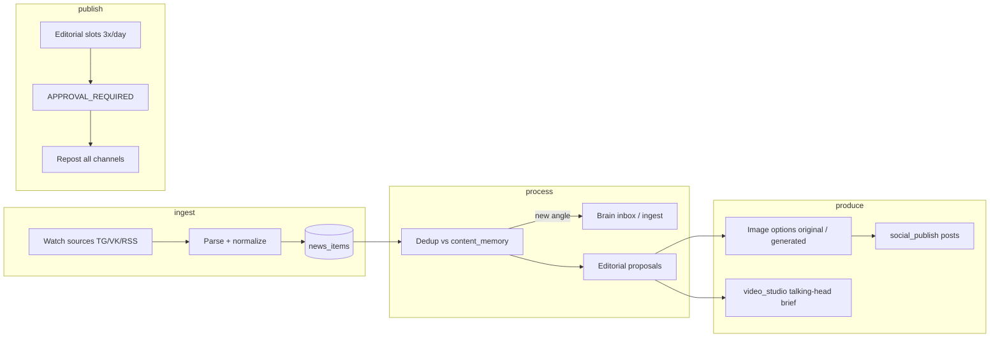

# Content Flywheel — Studio Architecture

Цель: **парсить новости из фоновых каналов → обработать → (опц.) в Knowledge → несколько раз в день публиковать релевантное**, без дублирования мыслей, с выбором картинки и мультиплатформенным репостом + **видео-серия** (talking head для YouTube / Instagram).

## Поток (target)



## Принципы

| Правило | Реализация |
|---------|------------|
| Не дублировать мысли | `content_memory` + fingerprint + overlap score |
| Не auto-publish | Все посты/видео — `APPROVAL_REQUIRED` |
| Помнить историю | memory привязана к `social_post_id` / `video_draft_id` |
| Картинки | `original` (из источника) + `generated` (SVG/AI позже) — оператор выбирает |
| Knowledge | Markdown в `brain_inbox/` + best-effort ingest files |
| Видео | Brief для talking-head серии; рендер — отдельный провайдер позже |

## Модули (код)

| Компонент | Путь | Роль |
|-----------|------|------|
| Watch + news | `modules/content_flywheel` | ingest, hash, status |
| Memory / dedup | `content_flywheel/memory.py` | fingerprints, similarity |
| Slots | `content_flywheel/slots.py` | 3×/day MSK default |
| Processor | `content_flywheel/processor.py` | news → proposal → post/video |
| Publish | `modules/social_publish` | channels, repost |
| Video | `modules/video_studio` | private + talking-head meta |
| Listen stub | `radar/owned_listen` | расширяется под news body |

## Env

```env
FLYWHEEL_ENABLED=true
FLYWHEEL_SLOTS_PER_DAY=3
FLYWHEEL_SLOT_HOURS=10,14,18
FLYWHEEL_TZ=Europe/Moscow
FLYWHEEL_SOURCE_TG=@industry_news,@competitor
FLYWHEEL_SOURCE_VK=news_group
FLYWHEEL_DEDUP_THRESHOLD=0.55
FLYWHEEL_AUTO_KB=true
FLYWHEEL_AVATAR_PROFILE=quantum-host-v1
```

## API (MVP)

- `GET/POST /api/modules/content_flywheel/sources` — watch-каналы
- `POST /api/modules/content_flywheel/ingest` — ручная новость / poll sources
- `GET /api/modules/content_flywheel/news` — очередь
- `POST /api/modules/content_flywheel/news/{id}/process` — dedup + KB + proposal
- `GET /api/modules/content_flywheel/proposals` — слоты на сегодня
- `POST /api/modules/content_flywheel/proposals/{id}/approve` → social_post + video brief
- `POST /api/modules/content_flywheel/run-cycle` — poll + process + fill slots
- `GET /api/modules/content_flywheel/memory` — что уже публиковали

## UI (Studio → Флайвил)

1. **Источники** — добавить watch-каналы
2. **Ingest** — Poll / вставить новость вручную
3. **Очередь** — новости → Process → proposal с 2 картинками
4. **Слоты** — сегодня 10:00 / 14:00 / 18:00 — approve → репост
5. **Память** — последние углы / темы (anti-dup)
6. **Видео** — talking-head brief для YouTube Reels / IG

## Этапы после MVP

1. Реальный TG/VK parser (Bot API / VK wall.get)
2. LLM angle extraction + SB citations
3. DALL-E / Flux для картинок
4. HeyGen / Synthesia talking-head render
5. Cron `run-cycle` на проде (systemd timer)
