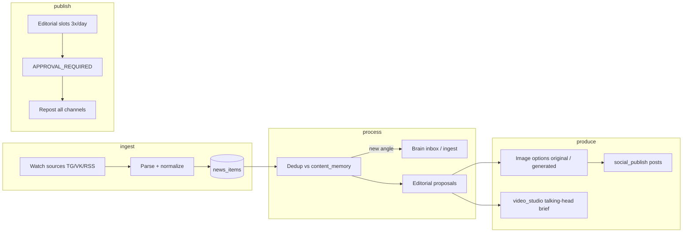

# Content Flywheel — Studio Architecture

Цель: **парсить новости из фоновых каналов → обработать → (опц.) в Knowledge → несколько раз в день публиковать релевантное**, без дублирования мыслей, с выбором картинки и мультиплатформенным репостом + **видео-серия** (talking head для YouTube / Instagram).

## Поток (target)



## Принципы

| Правило | Реализация |
|---------|------------|
| Не дублировать мысли | `content_memory` + fingerprint + overlap score |
| Не auto-publish | Все посты/видео — `APPROVAL_REQUIRED` |
| Помнить историю | memory привязана к `social_post_id` / `video_draft_id` |
| Картинки | `original` (из источника) + `generated` (SVG/AI позже) — оператор выбирает |
| Knowledge | Markdown в `brain_inbox/` + best-effort ingest files |
| Видео | Brief для talking-head серии; рендер — отдельный провайдер позже |

## Модули (код)

| Компонент | Путь | Роль |
|-----------|------|------|
| Watch + news | `modules/content_flywheel` | ingest, hash, status |
| Memory / dedup | `content_flywheel/memory.py` | fingerprints, similarity |
| Slots | `content_flywheel/slots.py` | 3×/day MSK default |
| Processor | `content_flywheel/processor.py` | news → proposal → post/video |
| Publish | `modules/social_publish` | channels, repost |
| Video | `modules/video_studio` | private + talking-head meta |
| Listen stub | `radar/owned_listen` | расширяется под news body |

## 2. Thematic lens (primary, tenant-defined)

**Универсальный инструмент для любой отрасли** — финтех только как один из пресетов. Greenfield deployment стартует с tenant `default` и пресета `generic`.

**Единая БД новостей** (`flywheel_news`) + автоматический анализ каждой записи по **тематике арендатора**:

| Поле | Смысл |
|------|--------|
| `theme_score` | 0..1 релевантность заданным темам |
| `theme_tags` | id тем из `content_theme.json` |
| `analysis_json` | editorial_hook, tier (high/medium/low/off_topic), lens_label |

Конфиг тем (порядок загрузки):

1. `{DATA_DIR}/tenants/{tenant_id}/content_theme.json` — runtime-редактирование из UI
2. `outreach/config/tenants/{tenant_id}/content_theme.json` — seed в репозитории
3. Пресет `generic` — минимальный fallback

Пресеты: `outreach/config/theme_presets/` — `generic` (default), `saas-b2b`, `real-estate`, `ecommerce`, `fintech-money-flows`, …

Env: `OUTREACH_TENANT_ID=default` (greenfield) или `quantum-labs` (текущий прод Quantum Labs).

Новости с `theme_score < min_score` → `skipped_theme` (не в слоты).  
`min_score` берётся из конфига; env `FLYWHEEL_THEME_MIN_SCORE` переопределяет.

**Угол публикации** строится из hook темы арендатора, не из сырой новости.

Модули: `modules/content_flywheel/theme_config.py`, `thematic.py`

API:

- `GET /themes` — конфиг + taxonomy
- `GET/PUT /themes/config` — чтение/сохранение
- `GET /themes/presets`, `POST /themes/apply-preset`
- `POST /themes/reanalyze` — переанализ новостей после смены тематики

### RSS sources

Любая отрасль может подключить RSS/Atom: UI **Флайвил → Источники → RSS** или `FLYWHEEL_SOURCE_RSS=url1,url2`.

### Auto-cycle

`FLYWHEEL_AUTO_CYCLE=true` + `FLYWHEEL_CYCLE_SECONDS=3600` — фоновый poll + process в процессе outreach.

## 3. Knowledge loop (optional layer)

| Direction | Mechanism |
|-----------|-----------|
| News → KB | `queue_flywheel_document` → `brain_inbox/` |
| KB → Posts | `knowledge_enrich.enrich_content_brief` → Second Brain search + `product_profile.json` |
| Products | `config/tenants/quantum-labs/product_profile.json` (Quantum Labs, Quantum Payouts) |

При **Process** / создании поста в «Соцсети»:
1. Запросы в `/api/brain/search` (hybrid) по новости + продуктам
2. Факты в блок **«Контекст»** в тексте поста и в talking-head сценарии
3. Citations в `kb_context` на карточке proposal (UI: строка KB)

Env: `FLYWHEEL_KB_ENRICH=true`, `CONTENT_USE_KB=true`, `KNOWLEDGE_BASE=http://127.0.0.1:8017`

## 3. Env

```env
FLYWHEEL_ENABLED=true
FLYWHEEL_SLOTS_PER_DAY=3
FLYWHEEL_SLOT_HOURS=10,14,18
FLYWHEEL_TZ=Europe/Moscow
FLYWHEEL_SOURCE_TG=@industry_news,@competitor
FLYWHEEL_SOURCE_VK=news_group
FLYWHEEL_DEDUP_THRESHOLD=0.55
FLYWHEEL_AUTO_KB=true
FLYWHEEL_AVATAR_PROFILE=quantum-host-v1
```

## API (MVP)

- `GET/POST /api/modules/content_flywheel/sources` — watch-каналы
- `POST /api/modules/content_flywheel/ingest` — ручная новость / poll sources
- `GET /api/modules/content_flywheel/news` — очередь
- `POST /api/modules/content_flywheel/news/{id}/process` — dedup + KB + proposal
- `GET /api/modules/content_flywheel/proposals` — слоты на сегодня
- `POST /api/modules/content_flywheel/proposals/{id}/approve` → social_post + video brief
- `POST /api/modules/content_flywheel/run-cycle` — poll + process + fill slots
- `GET /api/modules/content_flywheel/memory` — что уже публиковали

## UI (Studio → Флайвил)

1. **Источники** — добавить watch-каналы
2. **Ingest** — Poll / вставить новость вручную
3. **Очередь** — новости → Process → proposal с 2 картинками
4. **Слоты** — сегодня 10:00 / 14:00 / 18:00 — approve → репост
5. **Память** — последние углы / темы (anti-dup)
6. **Тематика** — линза, темы, ключевые слова (любая ниша); пресеты
7. **Видео** — talking-head brief для YouTube Reels / IG

## Этапы после MVP

1. ~~RSS ingest~~ ✅ `rss_fetch.py` + sources UI
2. ~~LLM angle extraction~~ ✅ optional `FLYWHEEL_LLM_ANGLE`
3. Реальный TG/VK parser (Bot API / VK wall.get)
4. DALL-E / Flux для картинок
5. HeyGen / Synthesia talking-head render
6. ~~Cron `run-cycle`~~ ✅ `FLYWHEEL_AUTO_CYCLE` background thread
