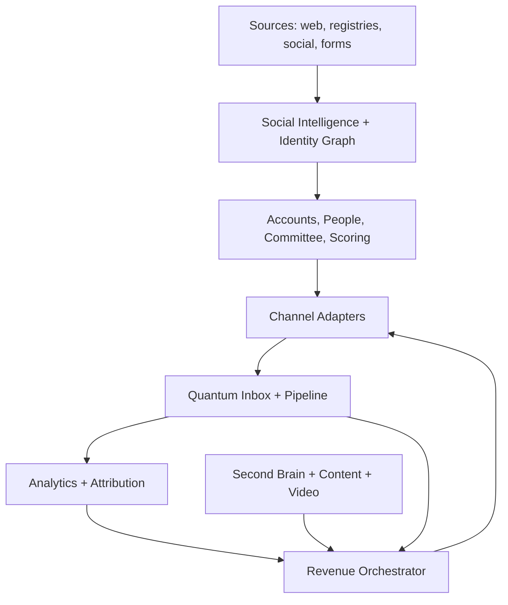

# TARGET ARCHITECTURE — Quantum Console AI Revenue OS

**Дата:** 2026-08-23  
**Источник:** `Quantum_Console_AI_Revenue_OS_Cursor_Spec.md` v1.1  
**Принцип:** сохранить стек (FastAPI + SQLite/Postgres + systemd), не плодить микросервисы до доказанной нагрузки.

---

## 1. Продуктовая формула

```text
Сигналы рынка
→ Account + Decision Committee
→ Social Intelligence / Identity Graph
→ персональная стратегия
→ email / AVA / social (capability-aware)
→ Quantum Inbox
→ квалификация → Opportunity → встреча
→ Analytics / Attribution
→ Second Brain + Content → новые лиды
```

**Термины:** Quantum Console (продукт) · Quantum Panel (UI) · Quantum Outreach · AVA · Radar · Social Intelligence · Identity Graph · Inbox · Content/Video Studio · Second Brain · Revenue Orchestrator.

---

## 2. Целевая схема



### Слои

1. **Presentation** — Quantum Panel (расширение текущего Console UI)
2. **Application** — REST (+ SSE позже), RBAC, use cases
3. **Domain** — accounts, people, social, outreach, inbox, calls, content, opportunities, knowledge, compliance
4. **Orchestration** — journeys, waits, approvals, stop-rules (код, не один промпт)
5. **Connectors** — email, AVA, Bitrix, Telegram, future social adapters
6. **Data** — relational DB, FTS/vector (уже в brain), object storage для media, queue, audit

---

## 3. Канонические сущности (адаптация к текущему стеку)

Начинаем **не с новых таблиц ради названий**, а с mapping:

| Канон ТЗ | AS-IS якорь | Целевой шаг |
|----------|-------------|-------------|
| `Tenant` | implicit `quantum-labs` | enforced tenant_id (Этап 1) |
| `Account` | `clients.companies` + Bitrix | единая карточка + lifecycle |
| `Person` | `clients.contacts` | + Identity Graph |
| `Employment` | director fields / Bitrix | явная связь person↔account |
| `ContactPoint` | emails / phones | verification + consent |
| `Conversation` / `Message` | reply_inbox + operator_replies + outbox | unified Inbox |
| `Call` | call_history.db | facade в Console |
| `Consent` / `Suppression` | consent_ledger + deliverability | org-wide API |
| `Lead` / `Opportunity` | Bitrix deals + vault statuses | локальная воронка + sync |
| `Journey` | sequences + runner | Orchestrator versions |
| `Knowledge*` | brain_platform | уже близко к цели |
| `SocialIdentity` / `CandidateProfile` | — | greenfield |
| `Content*` / `Video*` | — | greenfield Этапы 5–6 |

---

## 4. Режимы действий

Каждый channel action: `AUTO` | `APPROVAL_REQUIRED` | `MANUAL_TASK`.

Social cold outreach → **только** `MANUAL_TASK` (без browser automation).

---

## 5. Universal Social Intelligence (целевой контур)

1. Account resolution → 2. Role planning (DecisionRoleTemplate) → 3. Seed extraction →  
4. Query planning per network → 5. Candidate acquisition → 6. Normalization →  
7. Matching / scoring → 8. Identity clustering → 9. Human verification →  
10. Committee assembly → 11. Contact strategy (`AUTO`/`APPROVAL`/`MANUAL_TASK`).

Уровни: `VERIFIED` · `HIGH_CONFIDENCE` · `POSSIBLE` · `REJECTED` · `OUTDATED`.

---

## 6. Revenue Orchestrator

- Узлы: Trigger, Condition, Enrich, Score, Draft, Approval, Send, Manual Task, Call, Wait, Branch, Stop
- Guardrails: consent, suppression, quiet hours, frequency cap, budget, idempotency
- Stop: любой содержательный ответ, unsubscribe, meeting booked, wrong person, open opportunity conflict

LLM: research / classify / draft. **Состояние journey — в БД и коде.**

---

## 7. Tenant configuration packages

Не хардкодить ломбарды / Quantum Payouts. Пакет tenant:

`ProductProfile` · `ICPTemplate` · `DecisionRoleTemplate` · `SignalTemplate` · `OfferTemplate` · `QualificationSchema` · `JourneyTemplate` · `ContentPillarTemplate` · `ChannelPolicy` · `BrandProfile`

Первый tenant = Quantum Labs (конфиг, не код).

---

## 8. Стек (сохраняем)

| Сейчас | Цель |
|--------|------|
| FastAPI модульный монолит на сервис | Тот же стиль + общие domain packages |
| SQLite per service | Account/Person в одной БД; brain уже PG-ready |
| systemd units | Без Kubernetes на старте |
| Нет Celery | Фоновые threads / timers; queue — когда нагрузка |
| Один UI token | RBAC Этап 8; до этого — operator roles в Console |

Отдельный worker вероятен только для **video render**.

---

## 9. Первые вертикальные срезы (из ТЗ §25)

### Slice A — Unified inbound

```text
email reply | call completed
→ Account/Person resolve
→ Inbox thread
→ classification + summary
→ Lead/Opportunity/next action
→ audit + attribution
```

**Уже частично есть:** IMAP inbox, thread/reply, call notify, Bitrix deal on reply.  
**Дыры:** единый Account lifecycle, opportunity локально, attribution.

### Slice B — Universal LPR search

```text
company + DecisionRoleTemplate
→ adapters (VK/OK/TenChat/LinkedIn/Telegram/web/registry)
→ candidates + evidence
→ identity cluster + human verify
→ committee coverage
→ SocialActionTask (manual)
```

**Уже есть:** company card, DaData, Bitrix mirror, Telegram.  
**Дыры:** весь Social Intelligence stack.

---

## 10. Definition of Done (наследие ТЗ §23)

Любая функция: domain + API/UI + permissions + audit + tenant/suppression + tests + observability + docs + cost accounting где есть provider.
