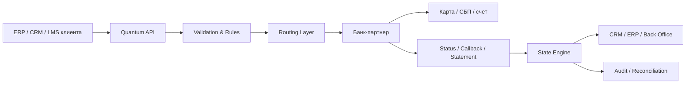

# Quantum Labs

> Каноническая база знаний Quantum Labs. Этот документ описывает компанию, продуктовую модель, отраслевые сценарии, правовые ограничения, банковские контуры, продажи, аутрич, внедрение и эксплуатационные стандарты. История задач, невыполненные обсуждения и проектные TODO сюда не включаются.

<!-- CHUNK: executive-summary -->

## Executive summary

Quantum Labs — это не банк и не сервис хранения клиентских денег. Каноническая модель компании: **деньги не проходят через Quantum Labs; расчетный слой остается у банку-партнеру, а Quantum Labs обеспечивает оркестрацию, интеграцию, маршрутизацию, контроль сценариев, статусы, аудит и сверку**. Такая модель лучше соответствует 161‑ФЗ о национальной платежной системе и гражданско-правовой конструкции номинального счета: платежная функция остается в банке, а технологическая и процессная — в IT‑слое. 

Главный отраслевой приоритет Quantum Payouts — **ломбарды**. По данным Банка России, в 2025 году ломбарды заключили почти 19 млн договоров займа, выдали 412 млрд рублей, а портфель рынка достиг 101 млрд рублей; 69% портфеля приходилось на топ‑50 игроков, а число точек выросло до 10 427. Это означает, что наиболее ценный ICP для Quantum Labs — сетевые и крупные региональные ломбарды с распределенной филиальной структурой, централизованным бэк‑офисом и острой проблемой наличных, лимитов, контроля сотрудников и day‑to‑day сверки. 

Самая безопасная и продаваемая ломбардная модель — **выплата займа только идентифицированному заемщику, который одновременно является залогодателем**, с привязкой каждой выплаты к конкретному залоговому билету. Статья 7 закона о ломбардах прямо говорит, что заем выдается гражданину‑заемщику, который одновременно является залогодателем; договор оформляется залоговым билетом, а залоговый билет должен содержать данные заемщика и условия договора потребительского займа. Поэтому выплата третьему лицу — не просто нежелательная практика, а внутренне запрещенный стандарт Quantum Labs из-за правового և AML‑риска. 

Для ломбардов у Quantum Labs есть второй сильный и юридически значимый оффер: **автоматизация возврата положительной разницы после реализации невостребованной вещи**. Закон требует вернуть заемщику разницу между суммой оценки или реализации и суммой обязательств, если возникло превышение; заемщик вправе обратиться за ней в течение трех лет со дня продажи вещи. Банк России отдельно рекомендовал ломбардам выстраивать информирование заемщика и рассматривать уведомление в течение 30 дней как лучшую практику. Это делает payout‑контур полезным не только для ускорения выдачи займа, но и для снижения комплаенс‑риска и операционного долга. 

Банковская стратегия Quantum Labs должна быть мультибанковской. Публичные источники подтверждают, что Альфа‑Банк продвигает массовые выплаты физлицам по номеру карты и телефона через СБП и номинальные счета для юрлиц, Сбер использует API‑контур с номинальным счетом и реестром бенефициаров в сервисе безопасных сделок, ВТБ раскрывает sandbox‑документацию по callback и возвратам в СБП‑сценариях, а T‑Bank публично документирует массовые выплаты, СБП, номинальные счета и webhooks по выписке. При этом точные лимиты и часть условий подключения часто **не раскрываются публично** и должны подтверждаться у RM, через коммерческий пакет и технический due diligence. 

Маркетингово Quantum Labs нельзя продавать как «просто массовые выплаты». Компанию нужно продавать как **систему управления payout‑процессом**. Владельцу бизнеса — как способ уменьшить хаос и кассовую нагрузку. CFO — как инструмент контроля и сверки. Операционному директору — как способ стандартизировать филиалы. Комплаенсу — как встроенный запрет на сомнительные сценарии. IT — как слой API, идемпотентности, webhook и traceability.

<!-- CHUNK: company-and-products -->

## О компании и продуктовой модели

### Что такое Quantum Labs

**Внутренний канонический тезис:** Quantum Labs — поставщик прикладной финансовой инфраструктуры для выплат юридических лиц физическим лицам через банк-партнер.

Эта формулировка важна, потому что она сразу отделяет компанию от:
- банка;
- электронного кошелька;
- сервиса хранения клиентских денег;
- схемы обхода комплаенса;
- «универсальной платежки без ограничений».

### Миссия

Миссия Quantum Labs — сделать выплаты юридических лиц физическим лицам:
- управляемыми;
- проверяемыми;
- масштабируемыми;
- совместимыми с банковскими и регуляторными требованиями.

### Основные продукты

#### Quantum Payouts

Флагманский продукт компании. Назначение:
- принимать бизнес‑событие клиента;
- превращать его в управляемую выплату;
- выбирать банковский маршрут;
- обеспечивать статусы, webhooks, аудит и сверку.

#### Quantum Outreach

Система аутрича и продажной автоматизации. Назначение:
- сегментация ICP;
- цепочки касаний;
- A/B‑тесты;
- передача лида в CRM;
- системное ведение first touch и follow‑up.

#### AVA

AI‑ассистент для продаж, поддержки и внутренних процессов. Назначение:
- отвечать по базе знаний;
- помогать в квалификации лидов;
- создавать черновики follow‑up;
- работать с CRM/телефонией/календарем;
- не импровизировать в неподтвержденных юридических вопросах.

### Принципы компании

#### Деньги не проходят через Quantum Labs

Это базовый архитектурный и коммерческий принцип. Платежная функция остается в банке. Если проект использует номинальный или специальный счет, правовая конструкция определяется законом и договором банка, а не произвольным описанием в продаже. ГК РФ прямо предусматривает номинальный счет как счет для операций с денежными средствами, права на которые принадлежат бенефициару; если бенефициаров несколько, должен вестись их раздельный учет. 

#### Любая выплата должна иметь основание

Выплата — это не «перевод ради перевода», а исполнение конкретного обязательства:
- выдача займа;
- страховая выплата;
- возврат клиенту;
- выплата по ГПХ;
- выкуп имущества;
- возврат положительной разницы;
- иные допустимые сценарии.

#### Продукт не должен разрушать KYC/AML‑контур

Если клиент не может доказать:
- кто получатель;
- на каком основании платит;
- какие реквизиты использует;
- почему выбран именно этот канал,
то такой payout‑сценарий в стандартном контуре Quantum недопустим. 115‑ФЗ требует идентификации клиента, а при ее непроведении — отказа в обслуживании. 

#### Лучше запретить спорное, чем разрешить серое

Для Quantum Labs опаснее всего не «потерять сделку», а продать схему, которую потом нельзя защитить перед:
- банком;
- юристом клиента;
- службой комплаенса;
- аудитом;
- регулятором.

### Что не входит в предмет компании

Quantum Labs **не является**:
- кредитной организацией;
- оператором перевода денежных средств в собственном расчетном контуре;
- местом хранения денег клиента;
- юридическим консультантом, заменяющим внешнее заключение;
- системой для обхода AML/KYC и банковских правил. 

<!-- CHUNK: payouts -->

## Quantum Payouts

### Каноническая роль продукта

Quantum Payouts — это orchestration layer для выплат физическим лицам через банк-партнер.

Роль банка:
- принять распоряжение;
- применить лимиты и правила;
- исполнить перевод;
- вернуть статус, выписку, callback.

Роль Quantum Labs:
- принять событие;
- проверить валидность данных;
- применить policy rules;
- маршрутизировать в банк;
- привести банковские статусы к единой модели;
- сохранить аудит;
- выполнить reconcile. 161‑ФЗ требует, чтобы распоряжение клиента содержало реквизиты, позволяющие осуществить перевод денежных средств. 

### Типовые сценарии Quantum Payouts

- выдача займа;
- страховая выплата;
- возврат денег клиенту;
- вознаграждение физическому лицу;
- выкуп имущества у физлица;
- расчет по ГПХ;
- выплата самозанятому;
- возврат положительной разницы;
- пакетные выплаты по реестру.

### Каналы выплат

#### Выплата на карту

Плюсы:
- понятна получателю;
- привычный UX;
- подходит для ряда банковских контуров.

Минусы:
- зависит от правил банка и эмитента;
- требует корректной работы с реквизитами;
- часть банков накладывает отдельные ограничения.

Публичные материалы T‑Bank подтверждают наличие card‑transfer сценариев и платежных API для бизнеса. 

#### Выплата через СБП

Плюсы:
- скорость;
- доступность;
- меньше ручного ввода.

Минусы:
- зависит от поддержки B2C‑сценария банком;
- лимиты и регламенты варьируются.

СБП — круглосуточный сервис Банка России, а в НПС на уровне инфраструктуры реализованы B2C‑выплаты юридических лиц в пользу физических лиц. Публичные материалы НСПК прямо описывают B2C как перечисления от юрлиц физлицам. 

#### Выплата по банковским реквизитам

Плюсы:
- более классическая банковская модель;
- понятна бухгалтерии.

Минусы:
- обычно хуже по UX;
- часто медленнее;
- выше требования к качеству реквизитов.

### Статусная модель

| Статус | Значение | Финальность |
|---|---|---|
| `CREATED` | Выплата создана | нет |
| `VALIDATING` | Идет проверка правил | нет |
| `QUEUED` | Поставлена в очередь | нет |
| `SENT_TO_BANK` | Передана в банк | нет |
| `BANK_ACCEPTED` | Банк принял инструкцию | нет |
| `PENDING` | Исполнение в процессе | нет |
| `MANUAL_REVIEW` | Требуется ручная проверка | нет |
| `SUCCESS` | Выплата исполнена | да |
| `FAILED` | Выплата не исполнена | да |
| `CANCELLED` | Выплата отменена до исполнения | да |
| `REVERSED` | Произошел возврат/разворот | да |

**Ключевой принцип:** `BANK_ACCEPTED` не равен `SUCCESS`.

### Идемпотентность

Идемпотентность обязательна. Публичная документация T‑API отражает дедупликацию операций по ключевым идентификаторам, что подтверждает отраслевой стандарт: одна бизнес‑операция не должна случайно создавать несколько выплат. 

**Внутренний стандарт Quantum:**
- каждая выплата обязана иметь `external_id` или `idempotency_key`;
- повтор с тем же ключом и тем же payload возвращает уже созданную сущность;
- повтор с тем же ключом и иным payload должен приводить к конфликту.

### Webhooks

Webhooks — канонический способ уведомления об изменении статуса. Публичная sandbox‑документация ВТБ показывает callback‑модель статусов и возвратов, а публичная документация T‑Bank рекомендует использовать webhook операции по счету для оперативного отслеживания статуса. 

### Ошибки

Базовые классы ошибок:
- `VALIDATION_ERROR`;
- `RECIPIENT_VERIFICATION_FAILED`;
- `POLICY_VIOLATION`;
- `LIMIT_EXCEEDED`;
- `BANK_TEMPORARY_UNAVAILABLE`;
- `BANK_REJECTED`;
- `DUPLICATE_REQUEST`;
- `MANUAL_REVIEW_REQUIRED`.

### API-примеры

#### Создать выплату

```http
POST /v1/payouts
Idempotency-Key: 7f9b1e68-1f7c-4f35-9d47-2b6b77f1a101
Content-Type: application/json
Authorization: Bearer <token>
```

```json
{
  "external_id": "loan-789234",
  "scenario": "pawn_loan_disbursement",
  "client_id": "client_001",
  "bank_route": "alfa_sbp_primary",
  "amount": 27000.00,
  "currency": "RUB",
  "channel": "SBP",
  "recipient": {
    "recipient_id": "borrower_456",
    "full_name": "Иванов Иван Иванович",
    "phone": "+79991234567",
    "document_type": "passport_rf",
    "document_number": "4510123456"
  },
  "source_document": {
    "document_type": "pawn_ticket",
    "document_number": "ПБ-2026-000781",
    "document_date": "2026-07-23"
  },
  "purpose": "Выдача займа по залоговому билету ПБ-2026-000781"
}
```

```json
{
  "payout_id": "po_01J1P9M5A2YQEXAMPLE",
  "status": "CREATED",
  "next_status": "VALIDATING",
  "trace_id": "trc_11f59a3a2d60"
}
```

#### Получить статус

```http
GET /v1/payouts/po_01J1P9M5A2YQEXAMPLE
Authorization: Bearer <token>
```

```json
{
  "payout_id": "po_01J1P9M5A2YQEXAMPLE",
  "external_id": "loan-789234",
  "status": "SUCCESS",
  "bank_status": "ACCEPTED",
  "bank_reference": "br_66281519",
  "completed_at": "2026-07-23T10:11:42Z"
}
```

#### Отменить выплату

```http
POST /v1/payouts/po_01J1P9M5A2YQEXAMPLE/cancel
Content-Type: application/json
Authorization: Bearer <token>
```

```json
{
  "reason_code": "CLIENT_REQUEST",
  "reason_comment": "Клиент отказался от получения займа до момента перевода"
}
```

```json
{
  "payout_id": "po_01J1P9M5A2YQEXAMPLE",
  "status": "CANCELLED"
}
```

#### Webhook

```json
{
  "event_id": "evt_01J1P9M8J7Q9EXAMPLE",
  "event_type": "payout.status_changed",
  "occurred_at": "2026-07-23T10:11:43Z",
  "attempt": 1,
  "data": {
    "payout_id": "po_01J1P9M5A2YQEXAMPLE",
    "status": "SUCCESS",
    "bank_reference": "br_66281519"
  }
}
```

#### Загрузка реестра

```http
POST /v1/registries
Content-Type: application/json
Authorization: Bearer <token>
```

```json
{
  "registry_id": "reg_2026_07_23_001",
  "scenario": "pawn_margin_refund",
  "items": [
    {
      "external_id": "refund-9001",
      "amount": 3500.00,
      "channel": "CARD",
      "purpose": "Возврат положительной разницы после реализации невостребованной вещи"
    },
    {
      "external_id": "refund-9002",
      "amount": 1800.00,
      "channel": "SBP",
      "purpose": "Возврат положительной разницы после реализации невостребованной вещи"
    }
  ]
}
```

```json
{
  "registry_id": "reg_2026_07_23_001",
  "status": "QUEUED",
  "items_total": 2,
  "accepted_items": 2,
  "rejected_items": 0
}
```

<!-- CHUNK: industries-and-lombards -->

## Отраслевые решения и ломбарды

### Сводка по приоритетам отраслей

| Вертикаль | Главный сценарий | Почему интересна |
|---|---|---|
| Ломбарды | выдача займа и возврат положительной разницы | высокий объем, ясная модель, сильная кассовая боль |
| МФО | мгновенная выдача займа | высокая частота и чувствительность к скорости |
| Страховые | клиентские выплаты и возвраты | большой объем массовых выплат |
| Trade‑in / выкуп техники | выплата продавцу после приемки | разрыв между приемкой и платежом |
| Самозанятые / ГПХ | пакетные выплаты | повторяемые реестровые процессы |
| Вторсырье / скупка | выплаты поставщикам‑физлицам | уход от наличных, контроль и AML |

### Почему ломбарды — рынок №1

По Банку России, в 2025 году ломбарды:
- заключили почти 19 млн договоров займа;
- выдали 412 млрд руб.;
- увеличили портфель до 101 млрд руб.;
- довели число точек до 10 427;
- концентрировали 69% портфеля у топ‑50 игроков. 

Это делает рынок идеальным для Quantum, потому что сочетает:
- повторяемость выплат;
- филиальную сеть;
- понятное право;
- заметную долю ручных и cash‑heavy процессов.

### Правовая модель ломбарда

Ломбард — это хозяйственное общество, включенное в государственный реестр ломбардов. Основные виды деятельности — краткосрочные займы гражданам под залог принадлежащих им движимых вещей, предназначенных для личного потребления, и хранение вещей. Закон также запрещает ломбарду заниматься иными видами предпринимательской деятельности, кроме прямо разрешенных. 

Заем:
- выдается на срок не более одного года;
- оформляется залоговым билетом;
- выдается гражданину‑заемщику, который одновременно является залогодателем;
- должен соответствовать требованиям закона о потребительском кредите в части условий, включаемых в залоговый билет. 

Ломбард обязан:
- страховать вещь за свой счет на сумму оценки;
- соблюдать льготный месячный срок перед обращением взыскания;
- вернуть заемщику положительную разницу после реализации вещи при наличии превышения;
- хранить вещь надлежащим образом и не пользоваться ей. 

### Типовые сценарии выплат для ломбардов

#### Выдача займа

**Стандарт Quantum:** выплата только заемщику, указанному в залоговом билете.

Обязательные опоры:
- подтвержденный получатель;
- номер залогового билета;
- документ‑основание;
- подтвержденный реквизит;
- понятный маршрут в банке.

#### Возврат положительной разницы

Это не “nice to have”, а юридически значимая обязанность ломбарда в соответствующих кейсах. Именно этот сценарий хорошо продается:
- юристам;
- комплаенсу;
- операционному директору;
- CFO.

#### Возврат / отмена ошибочной выплаты

Допустимы только в рамках банковского регламента конкретного канала.

### KYC, AML, ПОД/ФТ

115‑ФЗ требует идентификации клиента, а при непроведении идентификации — отказа в обслуживании. Для ломбардов это означает, что payout‑контур не может существовать отдельно от процедуры KYC. Положение Банка России 444‑П регулирует идентификацию НФО, а 445‑П — правила внутреннего контроля. 

Статья 6 115‑ФЗ относит к операциям обязательного контроля при достижении порога сумму 1 млн рублей и более; среди видов операций прямо названы помещение драгоценных металлов, камней, ювелирных изделий и лома таких изделий в ломбард. 

### Запрещенные сценарии

**Внутренний стандарт Quantum Labs:**
1. выплата займа третьему лицу;
2. выплата без залогового билета;
3. выплата по неподтвержденным реквизитам;
4. разделение одного займа на нескольких получателей;
5. выплата при неснятом AML‑флаге;
6. использование payout‑контура ломбарда для иной деятельности без отдельного юридического контура.

### Пример реестра

```csv
external_id,scenario,branch_id,pawn_ticket_no,pawn_ticket_date,borrower_id,full_name,document_type,document_number,channel,recipient_phone,amount,currency,purpose,operator_id
loan-789234,pawn_loan_disbursement,spb-014,ПБ-2026-000781,2026-07-23,borrower_456,Иванов Иван Иванович,passport_rf,4510123456,SBP,+79991234567,27000.00,RUB,Выдача займа по залоговому билету ПБ-2026-000781,usr_1088
```

### KPI пилота

| KPI | Цель |
|---|---|
| Время от оформления билета до денег у клиента | -40% и лучше |
| Доля безналичных выдач | +20 п.п. и лучше |
| Доля операций без ручного вмешательства | >95% |
| Ошибки реквизитов на 1000 выплат | -50% и лучше |
| Сверка day‑to‑day | >99% |
| Возвраты положительной разницы по регламенту | 100% в пилоте |

### Чек‑лист пилота

| Блок | Что нужно подтвердить |
|---|---|
| Юридический | ломбард в реестре Банка России |
| Юридический | пилот охватывает именно ломбардные займы |
| AML/KYC | подтверждено правило «получатель = заемщик» |
| ПД | определены роли по обработке ПД |
| Банк | получены лимиты, тесты, callback‑контур |
| Интеграция | согласованы поля реестра и API |
| Операции | роли филиала, центра, бухгалтерии, комплаенса |
| Поддержка | runbook, инцидентный канал, on‑call |

### Тест‑кейсы

1. Успешная выплата займа через СБП.
2. Успешная выплата займа на карту.
3. Повтор с тем же `external_id` не создает дубль.
4. Повтор с конфликтующим payload дает конфликт.
5. Попытка заплатить третьему лицу блокируется.
6. Выплата без номера билета отклоняется.
7. Отмена выплаты до исполнения работает корректно.
8. Потерянный webhook доставляется повторно и обрабатывается идемпотентно.
9. Реестр возврата положительной разницы проходит сверку.
10. Права доступа филиала и центра разделены.

<!-- CHUNK: banks-and-compliance -->

## Банки и комплаенс

### Что говорит право о номинальных и специальных счетах

ГК РФ предусматривает номинальный счет для операций с денежными средствами, права на которые принадлежат бенефициарам. Инструкция Банка России относит номинальные счета и сходные конструкции к специальным банковским счетам. Это означает, что номинальный счет — не «серая схема», а законная конструкция, но ее применимость всегда определяется конкретным банковским продуктом и договором. 

### Сравнение банков по публичным источникам

| Банк | Публично подтверждено | API / sandbox | СБП | Номинальный / спецсчет | Что важно для Quantum |
|---|---|---|---|---|---|
| Альфа‑Банк | массовые выплаты физлицам, СБП, номинальный счет, отраслевые сценарии | да | да | да | сильный кандидат для payout‑кейсов ломбардов и смежных verticals |
| Сбер | API‑контур безопасных сделок, номинальный счет, реестр бенефициаров | да | да для QR/приема | да | силен для сложных договорных моделей |
| ВТБ | sandbox по callback, возвратам и СБП‑сценариям | да | да | публично недостаточно данных | важен как API‑контур, но условия нужно уточнять |
| T‑Bank | массовые выплаты, T‑API, СБП, номинальные счета, webhooks выписки | да | да | да | ориентир по лучшим публичным API‑практикам |
| НСПК / СБП | инфраструктура B2C | API для части сценариев | да | не применимо | инфраструктурный аргумент, но не заменяет договор с банком |

Публичные материалы банков подтверждают наличие этих контуров, но **точные лимиты, тарифы, сроки подключения и отдельные юридические требования часто не раскрываются полностью**. Их нужно подтверждать в bank due diligence. 

### 152‑ФЗ и ПД

Для Quantum Labs критичны:
- основание обработки ПД;
- политика обработки;
- меры безопасности;
- уведомление Роскомнадзора при необходимости;
- локализация ПД россиян в предусмотренных законом случаях. 

### 63‑ФЗ и электронная подпись

Электронные документы и электронная подпись применимы там, где это допускает закон, нормативный акт или соглашение сторон. Квалифицированная подпись приравнивается к собственноручной, а простая и неквалифицированная применимы в предусмотренных случаях. 

### Договорные формулировки

#### О роли Quantum

> Исполнитель предоставляет Заказчику программное обеспечение и услуги по технологической маршрутизации, контролю и мониторингу операций, связанных с выплатами физическим лицам через банк-партнер. Исполнитель не является стороной денежного перевода между Заказчиком и Получателем, если иное прямо не предусмотрено отдельным соглашением сторон.

#### Об основании выплаты

> Заказчик гарантирует наличие законного и документально подтвержденного основания каждой выплаты, передаваемой в Систему.

#### Об идентификации получателя

> Заказчик гарантирует, что получатель выплаты идентифицирован в соответствии с применимым законодательством, требованиями банка-партнера и внутренними правилами Заказчика.

#### О запретах

> Система не должна использоваться для выплат, право на которые не подтверждено документально, для перечисления денежных средств ненадлежащим получателям, а также для операций, направленных на обход требований применимого законодательства, банка-партнера или внутренних правил комплаенса Заказчика.

<!-- CHUNK: sales-outreach-ava-architecture -->

## Продажи, Outreach, AVA и внедрение

### ICP

**Лучший ICP для Quantum в ломбардном сегменте:**
- сети 20+ точек;
- крупные региональные игроки;
- компании с личным кабинетом или элементами цифровизации;
- бизнесы с централизованным бэк‑офисом.

**Плохой первый ICP:**
- одиночные точки без IT;
- клиенты с серыми сценариями;
- клиенты, которые хотят платить «кому угодно»;
- клиенты, не готовые вовлекать юриста и комплаенс.

### Discovery‑вопросы

#### Общие
1. Как сейчас создается выплата?
2. Где живет статус?
3. Кто сверяет?
4. Какие ошибки происходят чаще всего?
5. Какой банк и канал используется?

#### Для ломбардов
1. Какой процент выдач наличный?
2. Есть ли единая LMS?
3. Как подтверждаются реквизиты заемщика?
4. Как обрабатывается положительная разница?
5. Где филиалы чаще всего ломают процесс?

### Скрипт холодного звонка

> Добрый день. Я из Quantum Labs. Мы помогаем ломбардным сетям переводить выдачу займов и связанные выплаты из ручной/кассовой модели в управляемый безналичный контур: выплата заемщику по залоговому билету, статусы, аудит, контроль филиалов и отдельный контур по возврату положительной разницы после реализации невостребованного залога. Подскажите, у вас сейчас основная боль — это касса, филиалы или сверка?

### Две e‑mail цепочки

#### Ломбарды

**Письмо 1.**  
Тема: Как сети ломбардов переводят выдачу займов из кассы в управляемый безналичный контур

Здравствуйте, {{name}}.  
Quantum Labs помогает автоматизировать выплаты физлицам через банк‑партнер. Для ломбардов чаще всего ценны два сценария: безналичная выдача займа заемщику по залоговому билету и payout‑контур для возврата положительной разницы после реализации залога. Если вам актуальны скорость выдачи, контроль филиалов и сверка, могу отправить outline пилота.

**Письмо 2.**  
Тема: Где сеть ломбардов теряет время в payout‑процессе

Чаще всего сеть теряет время на четырех вещах: кассовая нагрузка, разрыв между оформлением билета и фактической выплатой, отсутствие единой статусной модели и ручная обработка исключений. Мы закрываем именно этот слой.

**Письмо 3.**  
Тема: Пилот на 1 сценарии и 3–5 точках

Если длинный проект сейчас не в приоритете, можно проверить эффект на коротком пилоте: один сценарий, несколько точек, понятные KPI — время выдачи, ошибки, ручные действия и сверка.

#### МФО и смежные кейсы

**Письмо 1.**  
Тема: Как ускорить клиентские выплаты без ручных платежей

Quantum Labs помогает автоматизировать выплаты через банк‑партнер: API, статусы, идемпотентность, webhooks и сверка.

**Письмо 2.**  
Тема: Что обычно ломается в payout‑процессе

Обычно ломаются не переводы как таковые, а реквизиты, статусная логика, дедупликация и reconcile.

**Письмо 3.**  
Тема: Можем показать на одном вашем сценарии

Можно взять один поток — выдачу, возвраты или выплаты исполнителям — и показать, как он будет выглядеть в модели Quantum.

### Шаблоны сообщений

#### Telegram / WhatsApp

> {{name}}, добрый день. Я из Quantum Labs. Мы помогаем автоматизировать выплаты физлицам через банк‑партнер: API, статусы, аудит и контроль сценариев. По ломбардам чаще всего заходим через безналичную выдачу займа заемщику и payout‑контур для возврата положительной разницы после реализации залога. Если тема актуальна, отправлю короткий outline без презентации.

#### LinkedIn

> Hi {{name}}. We help businesses automate payouts to individuals through partner banks with a strong orchestration layer: statuses, idempotency, webhooks, controls and reconciliation. For pawnshop networks the strongest use cases are borrower loan disbursement and post-sale surplus refunds.

### Quantum Outreach

**Канонические функции:**
- сегментация лидов;
- цепочки касаний;
- A/B‑тесты;
- handoff в CRM;
- статусная модель лидов.

**Базовые статусы Outreach:**
- `NEW`
- `ENRICHED`
- `IN_SEQUENCE`
- `REPLIED`
- `INTERESTED`
- `MEETING_BOOKED`
- `DISQUALIFIED`
- `NO_RESPONSE`
- `BLACKLISTED`

### AVA

**Канонические роли AVA:**
- SDR‑ассистент;
- sales‑assistant;
- support‑assistant;
- internal knowledge assistant;
- telephony assistant.

**Что AVA запрещено:**
- обещать обход банка;
- придумывать юридические разрешения;
- подтверждать допустимость выплаты третьему лицу в ломбардном сценарии;
- раскрывать ПД без оснований.

### Архитектурная диаграмма



### FAQ

#### Продукт
**Что такое Quantum Payouts?**  
Оркестрационный слой для выплат физлицам через банк-партнер.

**Держит ли Quantum деньги клиента?**  
Нет.

**Зачем нужен отдельный payout‑слой, если есть банк?**  
Потому что банк дает расчетную инфраструктуру, а Quantum — бизнес‑оркестрацию и контроль процесса.

#### Ломбарды
**Можно ли платить заем третьему лицу?**  
В стандартном продукте Quantum — нет.

**Нужен ли номер залогового билета?**  
Да.

**Можно ли выплачивать до оформления билета?**  
Нет.

**Что делать с положительной разницей?**  
Возвращать заемщику при наличии превышения.

#### Комплаенс
**Можно ли считать подтверждение телефона достаточной идентификацией?**  
Нет.

**Что делать при AML‑флаге?**  
Переводить операцию в `MANUAL_REVIEW`.

**Можно ли логировать полные паспортные данные и карты?**  
Нет.

#### Банки
**Нужен ли адаптер под каждый банк?**  
Да.

**Если у банка нет webhook, это стоп?**  
Нет, но ухудшается статусная модель.

**Когда нужен номинальный счет?**  
Когда этого требует банковская и юридическая модель проекта.

### Шаблоны

#### Brief нового клиента

```markdown
Название компании:
Вертикаль:
Количество точек / филиалов:
Банк / банки:
Текущий способ выплат:
Основной сценарий для пилота:
Юридическое основание выплат:
Средний чек:
Пиковый объем выплат в день:
Нужные каналы:
Требования к статусам:
Есть ли webhook / API / реестры:
Главные боли:
Главные запреты / комплаенс-ограничения:
Целевой срок запуска:
```

#### Pilot scope

```markdown
Сценарий пилота:
Банк:
Количество точек / пользователей:
Ограничение по сумме:
Набор обязательных полей:
Метод подтверждения реквизитов:
Контур ручной эскалации:
KPI:
Критерии успеха:
Критерии остановки:
Ответственные со стороны клиента:
Ответственные со стороны Quantum:
```

#### Инцидентный runbook

```markdown
Инцидент ID:
Класс инцидента:
Затронутый банк/канал:
Затронутый клиент/сценарий:
Время начала:
Симптом:
Есть ли риск дублей:
Есть ли риск недоставки:
Статус affected payouts:
Временный workaround:
Кого уведомить:
ETA следующего обновления:
RCA:
Профилактические действия:
```

### Глоссарий

- **Quantum Payouts** — продукт для маршрутизации и контроля выплат.
- **Quantum Outreach** — система аутрича и продажной автоматизации.
- **AVA** — AI‑ассистент для продаж, поддержки и внутренних операций.
- **Payout** — единичная выплата.
- **Registry** — пакет выплат.
- **Source document** — первичный документ‑основание.
- **Bank route** — банковский маршрут исполнения.
- **Idempotency key** — ключ защиты от дублей.
- **Reconciliation** — сопоставление бизнес‑события, статуса Quantum и банковского подтверждения.
- **Pawn ticket** — залоговый билет ломбарда; обязательный документ, которым оформляется договор займа. 

<!-- CHUNK: limitations -->

## Open questions и ограничения

Точные лимиты, тарифы, сроки подключения, часть условий callback и возвратов у банков **часто не раскрываются публично**. Для любого боевого проекта эти параметры должны подтверждаться отдельно через:
- RM банка;
- коммерческий пакет;
- технический due diligence;
- проектное приложение к договору. 

Если сценарий клиента требует:
- выплаты третьим лицам в ломбардной модели;
- смешения ломбардной деятельности со скупкой или комиссией;
- серых или неочевидных оснований выплаты;
- использования неподтвержденных реквизитов,
то такой сценарий должен считаться **запрещенным по умолчанию** до получения отдельного юридического заключения и письменного подтверждения банковской допустимости.
