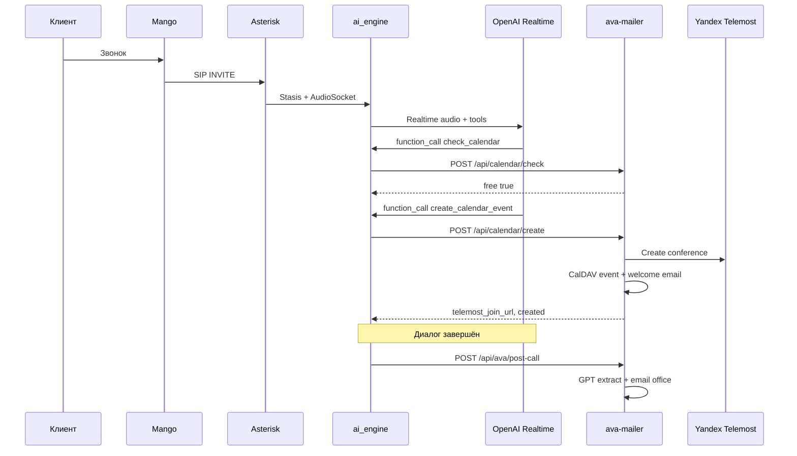

# Quantum Labs AVA — обзор системы

> Imported from `/root/ava/docs/SYSTEM_OVERVIEW.ru.md` for Second Brain. Secrets must not be added here.

# Quantum Labs AVA — обзор системы

Документ для людей и для AI-агентов: расширенное описание продакшен-стека голосового ассистента на этом сервере. **Краткая версия для агентов:** [`/root/ava/AGENTS.md`](../AGENTS.md).

---

## 1. Бизнес-назначение

**AVA** (Asterisk Voice Agent) на базе open-source [Asterisk AI Voice Agent](https://github.com/hkjarral/Asterisk-AI-Voice-Agent) адаптирована под **Quantum Labs**:

| Задача | Как реализовано |
|--------|------------------|
| Принять входящий звонок на номер компании | Mango Office → SIP → Asterisk |
| Поздороваться и вести диалог по-русски | OpenAI Realtime (`gpt-realtime-2`, голос `cedar`) |
| Записать клиента на встречу | Сценарий в промпте + tools `check_calendar` / `create_calendar_event` |
| Проверить свободное время | HTTP → ava-mailer → Mail.ru CalDAV |
| Создать событие в календаре | CalDAV + ICS |
| Выдать ссылку на видеовстречу | Yandex Telemost API (OAuth) |
| Отправить клиенту письмо с PDF | SMTP + `WELCOME_PDF_PATH` |
| После звонка уведомить офис | Webhook `mailru_post_call` → GPT-разбор транскрипта → email |

Ассистент **не** озвучивает технические термины и системные сообщения; email может произноситься латиницей по правилам промпта.

---

## 2. Архитектура (подробно)

### 2.1. Телефония

1. **Mango Office** — облачная АТС, SIP-транк на сервер Asterisk.
2. **PJSIP** — объекты `mango-registration` (исходящая регистрация на `vpbx*.mangosip.ru`), `mango-endpoint` (входящие с сетей Mango), `mango-auth`.
3. **Dialplan** `[from-mango]` в `/etc/asterisk/extensions.conf`:
   - Ответ на вызов (`Answer`).
   - Переменные `AI_CONTEXT=default`, `AI_PROVIDER=openai_realtime`.
   - Передача в Stasis-приложение `asterisk-ai-voice-agent`.
4. **Локальный тест без Mango:** endpoint `ava-test` принимает SIP только с `127.0.0.1`; скрипт `quantum_sip_test_call.py` шлёт INVITE на порт 5060.

### 2.2. AI Voice Agent (`/root/ava`)

Контейнер **`ai_engine`** (Docker, `network_mode: host`):

- Подписывается на ARI Stasis events.
- Поднимает **AudioSocket** сервер (порт **8090**) для медиа.
- Держит WebSocket к **OpenAI Realtime API** (модель из конфига).
- Транскодирует аудио: телефония **μ-law 8 kHz** ↔ внутренний PCM провайдера 24 kHz.
- Выполняет **in-call HTTP tools** и **post-call webhooks** по YAML.

Точка входа процесса в контейнере — **`/app/main.py`**, который должен оставаться **тонкой обёрткой**:

```python
from src.engine import main
asyncio.run(main())
```

Вся логика — в `src/engine.py` (~14k строк): сессии, VAD, barge-in, tool registry, провайдеры.

### 2.3. AVA Mailer (`/opt/ava-mailer`)

Отдельный сервис **FastAPI** на порту **8000** (systemd `ava-mailer.service`):

- Не участвует в RTP; только HTTP из `ai_engine` и внешние OAuth callback.
- Интеграция с **Mail.ru Calendar** через CalDAV.
- **OpenAI** (отдельный ключ в `.env` mailer) — для post-call извлечения полей из транскрипта.
- **Yandex OAuth** — модуль `yandex_oauth.py`, файл токенов JSON.

### 2.4. Диаграмма потоков данных



---

## 3. Конфигурация

### 3.1. Два уровня YAML

| Файл | Роль |
|------|------|
| `config/ai-agent.yaml` | Upstream defaults (провайдеры, pipelines, примеры tools) |
| `config/ai-agent.local.yaml` | **Продакшен Quantum Labs** — merge поверх base |

Механизм: `load_yaml_with_local_override()` в `src/config/loaders.py` — рекурсивный deep merge; `null` в local удаляет ключ из результата.

### 3.2. Что задано в local на этом сервере

- **contexts.default:** русский промпт сценария записи, greeting Quantum Labs.
- **providers.openai_realtime:** `api_version: ga`, `model: gpt-realtime-2`, VAD `server_vad`, транскрипция `gpt-realtime-whisper` + `ru`.
- **in_call_tools:** `check_calendar`, `create_calendar_event` → `127.0.0.1:8000`.
- **tools.mailru_post_call:** post-call webhook.
- **barge_in / streaming:** тюнинг под телефонию (защита после TTS, jitter buffer).

### 3.3. Окружение

| Файл | Содержимое (категории) |
|------|------------------------|
| `/root/ava/.env` | OpenAI, Asterisk ARI, health port, TZ, пути записи |
| `/opt/ava-mailer/.env` | SMTP, CalDAV, WEBHOOK_TOKEN, Yandex OAuth, Telemost, welcome email |

**Правило:** значения секретов только в `.env` на диске; в git — `.gitignore`.

---

## 4. Сценарий разговора (логика продукта)

Промпт в `ai-agent.local.yaml` задаёт **строгую последовательность**:

1. Имя → повтор и подтверждение (без подтверждения дальше нельзя).
2. Компания (опционально).
3. Интерес / задача.
4. Дата и время.
5. Email → повтор и подтверждение.
6. `check_calendar` только при наличии дата+время и подтверждённого email.
7. Если `free=false` — предложить другое время.
8. Если `free=true` — сразу `create_calendar_event`.
9. Успех — одна фиксированная фраза про фиксацию и письмо.
10. Прощание → `hangup_call` (встроенный tool движка).

Поля для `create_calendar_event`: `start`, `summary`, `description`, `attendee_email`.

---

## 5. API ava-mailer

Базовый URL: `http://127.0.0.1:8000` (с хоста; `ai_engine` в host network видит тот же адрес).

### 5.1. Calendar

- **`POST /api/calendar/check`** — body: `{ "start": "YYYY-MM-DD HH:MM", "timezone": "Europe/Moscow" }` → `{ "ok", "free", "start", "end" }`.
- **`POST /api/calendar/create`** — ручной парсинг body (устойчивость к многострочному JSON от AVA). При занятом слоте: `{ "created": false, "reason": "slot_busy" }`.
- **`POST /api/calendar/suggest`** — альтернативные слоты (в голосовом сценарии сейчас не в allowlist, но API есть).

### 5.2. Post-call

- **`POST /api/ava/post-call`** — заголовок `X-Webhook-Token` (см. `.env` `WEBHOOK_TOKEN`).
- Нормализация транскрипта, `extract_structured_data`, отправка письма менеджеру.

### 5.3. OAuth Yandex

- `GET /oauth/yandex/status` — диагностика токена (с webhook token).
- `GET /oauth/yandex/start?token=...` — начало OAuth.
- `GET /oauth/yandex/callback` — callback Яндекса.
- Токены на диске: `yandex_oauth_tokens.json` (права 600).

### 5.4. Welcome email

После создания встречи:

- Письмо на `attendee_email` с текстом приветствия и вложением PDF (`WELCOME_PDF_PATH`).
- В теле — ссылка Telemost, если создана.
- Логи: `[WELCOME EMAIL] sent to=... pdf_attached=...`

---

## 6. Наблюдаемость и админка

- **Health AI:** `http://127.0.0.1:15000/health` — `ari_connected`, `audiosocket_listening`, статус провайдеров.
- **Metrics:** `http://127.0.0.1:15000/metrics` (Prometheus).
- **admin_ui:** порт 3003, управление docker compose, история звонков (upstream).
- **Логи:** `docker logs ai_engine`, `journalctl -u ava-mailer`.

---

## 7. Тестирование

### 7.1. `quantum_e2e_test.py`

Секции:

| Секция | Проверяет |
|--------|-----------|
| `infra` | extensions.conf, Mango Registered |
| `ai_engine` | /health, calendar tools в yaml |
| `mailer` | systemd, /health, check+create в **2099** |
| `post_call` | webhook + 401 на плохой token |
| `oauth` | Yandex token valid |
| `sip_call` (full) | `quantum_sip_test_call.py` + паттерны в логах |

Флаги: `--quick`, `--full`, `--section mailer`, `--json`, `--verbose`.

### 7.2. Другие скрипты

- `test_calendar_email_chain.py` — цепочка calendar + post-call.
- `backup_quantum_labs.sh` — rsync ava/mailer, снимки asterisk CLI, tarball в `/root/backups/`.

---

## 8. Эксплуатация и восстановление

### 8.1. Перезапуск

```bash
systemctl restart ava-mailer
cd /root/ava && docker compose restart ai_engine
asterisk -rx "dialplan reload"
```

### 8.2. Восстановление из бэкапа

См. `RESTORE.md` внутри архива бэкапа (создаётся `backup_quantum_labs.sh`): rsync каталогов, reload dialplan, restart сервисов, quick E2E, при необходимости Yandex OAuth.

### 8.3. Типичные инциденты

Подробная таблица — в [`AGENTS.md`](../AGENTS.md#типичные-сбои-и-исправления). Ключевые темы:

- **Обрезанный `main.py`** — восстановить 10-строчную обёртку.
- **GA Realtime и temperature** — не отправлять beta-only `session.temperature` при `api_version: ga` (логика в `src/providers/openai_realtime.py`).
- **slot_busy в тестах** — не использовать «завтра 15:00» без проверки; E2E использует 2099-12-*.
- **Telemost без OAuth** — пройти OAuth start URL; проверить `yandex_oauth.py` и token file.

---

## 9. Границы ответственности (что править где)

| Изменение | Где |
|-----------|-----|
| Текст ассистента, порядок вопросов | `config/ai-agent.local.yaml` → `contexts.default.prompt` |
| Голос, VAD, модель OpenAI | `providers.openai_realtime` в local yaml |
| URL calendar tools | `in_call_tools.*.url` в local yaml |
| SMTP, CalDAV, Telemost, welcome | `/opt/ava-mailer/.env` + `main.py` только при новой бизнес-логике |
| Маршрутизация звонка | `/etc/asterisk/extensions.conf` |
| SIP trunk Mango | PJSIP объекты (CLI / realtime) |

**Не дублировать** календарную логику внутри `src/engine.py` — только HTTP tools.

---

## 10. Безопасность

- Не коммитить `.env`, токены OAuth, дампы бэкапов в публичные репозитории.
- `X-Webhook-Token` / `WEBHOOK_TOKEN` — единая пара для post-call и OAuth admin endpoints.
- ARI пароль — в `.env` и `ari.conf` на сервере; агентам в чат не выводить.

---

## 11. Связь с upstream-документацией

Проект `/root/ava` содержит полный комплект docs upstream (Configuration-Reference, Provider-OpenAI-Setup, TROUBLESHOOTING_GUIDE и др.). Для Quantum Labs **приоритет** у этого overview и `AGENTS.md`; upstream — для глубокой настройки других провайдеров (local, Deepgram, Google Live), которые на этом сервере не являются основным прод-путём.

---

*Документ сопровождает продакшен Quantum Labs; при изменении архитектуры обновляйте также `AGENTS.md`.*
